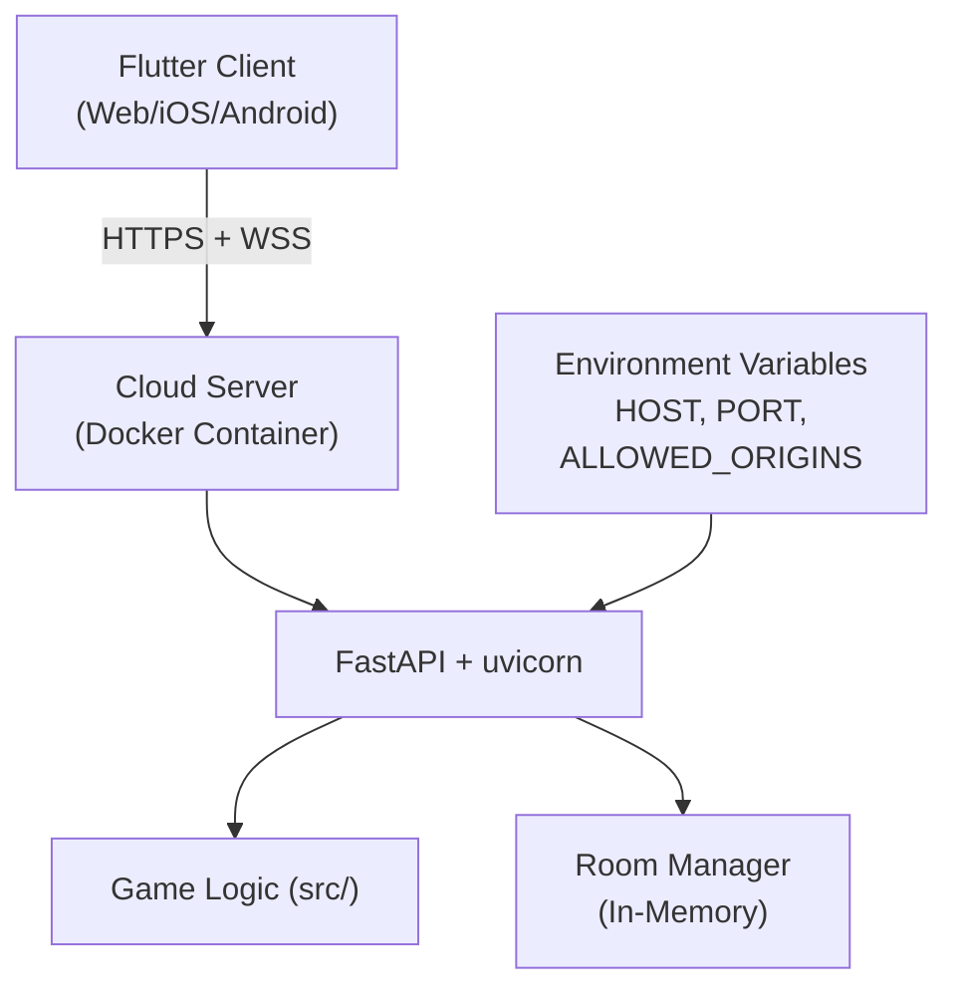
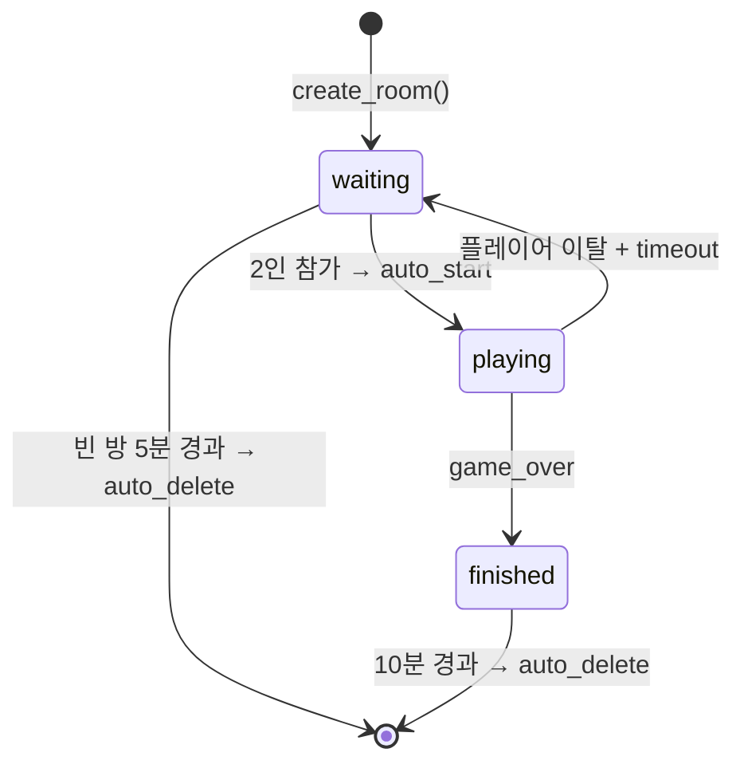

# Online Multiplayer PRD

**버전**: 3.6
**작성일**: 2026-03-02
**상태**: 구현 완료
**목적**: OFC Pineapple 온라인 멀티플레이어 + Flutter Web + 크로스 네트워크 플레이 + Public Room Listing

---

## 1. 개요

### 1.1 목적

Python 중앙 게임 서버(Docker)를 통한 온라인 멀티플레이어를 구현하고, Flutter Web 플랫폼을 추가하여 Web/iOS/Android에서 동일한 게임 경험을 제공한다. 크로스 네트워크 플레이를 지원하여 서로 다른 네트워크의 플레이어가 클라우드 서버를 통해 대전할 수 있다.

### 1.2 배경

초기 LAN 구현(dart:io HttpServer + bonsoir mDNS)은 Flutter Web 미지원 및 구조적 한계로 인해 완전히 제거되었다. 현재는 Python 중앙 게임 서버(FastAPI + WebSocket)가 유일한 멀티플레이어 백엔드이며, Docker로 배포한다.

### 1.3 범위

**포함**: Flutter Web 플랫폼, Python 중앙 게임 서버, 온라인 로비/매칭, 모드 선택 UI, Docker 배포, 재접속 메커니즘, 세션 토큰, WSS 지원, **Public Room Listing (실시간 방 목록 WebSocket Push)**
**제외**: 인증 시스템(MVP에서 닉네임만 사용), 랭킹/ELO, 관전 모드, 채팅, **LAN 멀티플레이어 (제거됨 — dart:io, bonsoir, mDNS 전체 삭제)**

---

## 2. 이전 아키텍처 (LAN) — 제거됨

> **2026-03-01 완전 제거됨.** 아래 파일들은 모두 삭제되었다. 참고 기록으로만 남긴다.

| 컴포넌트 | 파일 (삭제됨) | 역할 |
|----------|--------------|------|
| GameServer | `network/game_server.dart` | dart:io HttpServer + WebSocket (앱 내장) |
| GameClient | `network/game_client.dart` | web_socket_channel WebSocket 연결 |
| Discovery | `network/discovery.dart` | bonsoir mDNS LAN 탐색 |
| NetworkGameProvider | `providers/network_game_provider.dart` | Riverpod 상태 (host/join/disconnect) |
| Messages | `network/messages.dart` | MessageType enum 10종 |
| LobbyScreen | `ui/screens/lobby_screen.dart` | LAN 로비 화면 |

**제거 사유**: dart:io → Web 불가, mDNS → Web 미지원, 서버 내장 → 온라인 불가. Docker 전용 서버로 전환하여 LAN 모드 불필요.

---

## 3. 목표 아키텍처 (Online)

```
Flutter Client (Web/iOS/Android)
    │
    │ WebSocket /ws/lobby        ← 실시간 방 목록 Push (Lobby Channel)
    │ WebSocket /ws/game/{room_id} ← 게임 상태 (Game Channel)
    │ REST API /api/rooms          ← CRUD 조작
    │
    ▼
Python Server (FastAPI)
    ├── 로비: 방 생성/목록/참가 + Lobby Broadcast
    ├── 매칭: WebSocket 세션 관리
    ├── 게임 로직: src/ 모듈 활용
    └── 결과: 점수 계산/전달
```

**핵심 원칙**: 게임 로직은 서버 측에서 검증한다. 클라이언트는 UI/입력만 담당한다.

### 3.1 크로스 네트워크 배포 아키텍처



- 서버는 클라우드(Docker)에서 실행되며, 공개 URL로 접근 가능
- 클라이언트는 HTTPS(REST) + WSS(WebSocket)로 서버에 연결
- 환경 변수로 호스트, 포트, CORS 허용 도메인을 설정

---

## 4. 기술 요구사항

### 4.1 Python 게임 서버 (`server/`)

| 항목 | 사양 |
|------|------|
| 프레임워크 | FastAPI + uvicorn |
| WebSocket (Game) | `/ws/game/{room_id}` — 게임 세션 전용 |
| WebSocket (Lobby) | `/ws/lobby` — 실시간 방 목록 Push (Public Room Listing) |
| REST API | `POST /api/rooms`, `GET /api/rooms`, `DELETE /api/rooms/{id}` |
| 게임 로직 | 기존 `src/board.py`, `src/hand.py` 등 Python 모듈 재활용 |
| 상태 관리 | 인메모리 (MVP), 방별 게임 세션 |

**메시지 프로토콜**: 기존 MessageType 10종을 JSON 형태로 유지. 추가 타입:

| 추가 MessageType | 용도 |
|-----------------|------|
| `roomCreated` | 방 생성 확인 |
| `roomList` | 방 목록 응답 |
| `playerLeft` | 플레이어 퇴장 알림 |
| `heartbeat` | 연결 유지 확인 |
| `error` | 서버 오류 전달 |

### 4.2 Flutter Web 플랫폼 추가

| 항목 | 처리 |
|------|------|
| 플랫폼 추가 | `flutter create --platforms web .` |
| dart:io 분기 | LAN 관련 dart:io 코드 완전 제거됨. 조건부 import 불필요 |
| bonsoir | pubspec.yaml에서 제거됨 |
| LAN 모드 | 완전 제거됨. Online 모드만 제공 |

### 4.3 Flutter 클라이언트 변경

| 파일 | 변경 |
|------|------|
| `providers/online_game_provider.dart` | 온라인 WebSocket 연결, 방 관리 |
| `ui/screens/online_lobby_screen.dart` | 방 목록, 생성, 참가 UI |
| `ui/screens/home_screen.dart` | VS AI / 2P Local / Online Play / How to Play 선택 |
| `network/online_client.dart` | 서버 REST + WebSocket 클라이언트 |

### 4.4 보안

- 서버 측 게임 로직 검증: 유효하지 않은 카드 배치 거부
- WebSocket heartbeat: 30초 간격, 3회 미응답 시 연결 종료
- 닉네임 기반 식별 (MVP, 인증 없음)
- 동시 방 참여 불가 (1인 1방)

### 4.5 배포 요구사항

| 항목 | 사양 |
|------|------|
| 컨테이너 | Docker (Python 3.12 slim 이미지) |
| Dockerfile | 프로젝트 루트 `Dockerfile` — 멀티스테이지 빌드 불필요 (Python only) |
| docker-compose | 프로젝트 루트 `docker-compose.yml` — 단일 서비스 (ofc-server) |
| 포트 | 기본 8000, `PORT` 환경 변수로 변경 가능 |
| 실행 방식 | Docker CMD: `python -m uvicorn server.main:app` (서버 내 `if __name__` 없음) |

**환경 변수**:

| 변수 | 기본값 | 설명 |
|------|--------|------|
| `HOST` | `0.0.0.0` | 바인드 주소 |
| `PORT` | `8000` | 서버 포트 |
| `ALLOWED_ORIGINS` | `*` | CORS 허용 도메인 (쉼표 구분) |
| `WS_HEARTBEAT_INTERVAL` | `25` | WebSocket heartbeat 간격 (초) |
| `RECONNECT_TIMEOUT` | `60` | 재접속 대기 시간 (초) |

프로젝트 루트 `.env.example` 파일로 기본값을 문서화한다.

### 4.5.1 외부 네트워크 접속 방법

서로 다른 네트워크의 플레이어가 접속하려면 서버가 공개 인터넷에서 접근 가능해야 한다.

| 방법 | 난이도 | 비용 | 적합 상황 |
|------|--------|------|-----------|
| **ngrok 터널링** | 하 | 무료 | 테스트/임시 플레이 |
| **클라우드 VPS** | 중 | 월 $5~ | 상시 운영 |
| **포트 포워딩** | 중 | 무료 | 고정 IP 있을 때 |

**ngrok 실행 (권장 — 가장 간편)**:

```bash
# 1. Docker 서버 실행
docker compose up -d

# 2. ngrok 터널 생성 (최초 1회: ngrok config add-authtoken <TOKEN>)
ngrok http 8000

# 3. 출력된 공개 URL을 상대에게 공유
#    예: https://abc123.ngrok-free.app
#    → 브라우저에서 접속하면 Flutter Web SPA 로드
```

**참고**: ngrok 무료 플랜은 세션당 URL이 변경됨. 첫 접속 시 ngrok 경고 페이지에서 "Visit Site" 클릭 필요.

### 4.6 재접속 요구사항

1. 플레이어 참가 시 서버가 세션 토큰(UUID) 발급 → `joinResponse`에 `sessionToken` 포함
2. 연결 끊김 시 `RECONNECT_TIMEOUT` 이내 동일 토큰으로 재접속 가능
3. **자동 재접속 트리거**: `onDone`/`onError` 이벤트 감지 시 클라이언트가 즉시 자동 재접속 시도 (수동 호출 불필요)
4. **Exponential Backoff**: 재접속 지연 1s→2s→4s→8s→16s + random jitter (0~500ms), 최대 5회 시도
5. **서버 인증 응답 대기**: `reconnect` 메시지 전송 후 서버의 `reconnected` 응답 수신을 10초 이내 확인. 미수신 시 실패 처리
6. **Ghost connection 감지**: 서버는 `WS_PING_TIMEOUT` (60초) 동안 무응답 WebSocket을 자동 정리. FastAPI/Starlette WebSocket ping/pong 기반
7. **연쇄 장애 방지**: 서버 메시지 전송 except 블록에서 dead WebSocket에 send 실패 시 해당 루프만 안전하게 탈출. 상대 플레이어 연결에 영향 없음
8. **broadcast 안전성**: dead WS에 broadcast 실패 시 `remove_player` 미호출. disconnect 핸들러가 단일 진입점으로 플레이어 제거 담당
9. 재접속 성공 시 서버가 `playerReconnected` 메시지를 상대에게 브로드캐스트
10. 타임아웃 초과 시 해당 플레이어 기권 처리 (`playerForfeited`)

**UI 상태 표시**:

| 상태 | UI 표시 |
|------|--------|
| 재접속 시도 중 | Reconnecting overlay (spinner + 시도 횟수/최대 횟수 표시) |
| 재접속 최종 실패 | Error overlay — "Retry" (재시도) / "Back to Home" (홈 복귀) 버튼 제공 |
| 상대방 연결 끊김 | 게임 화면 상단 배너 — "Opponent disconnected, waiting to reconnect..." |

### 4.7 보안 (크로스 네트워크)

| 항목 | 사양 |
|------|------|
| WebSocket 프로토콜 | 프로덕션: `wss://`, 로컬 개발: `ws://` |
| CORS | `ALLOWED_ORIGINS` 환경 변수로 허용 도메인 제한 |
| 세션 토큰 | 참가 시 발급, 재접속 시 검증 (UUID v4) |
| Rate Limiting | MVP 제외 (향후 추가) |

### 4.8 Public Room Listing (실시간 방 목록)

**업계 표준 패턴**: Hybrid (REST + WebSocket Push) — Colyseus, Nakama, Socket.IO 공통 패턴

#### 4.8.1 Lobby WebSocket (`/ws/lobby`)

| 항목 | 사양 |
|------|------|
| 엔드포인트 | `/ws/lobby` |
| 프로토콜 | WebSocket (ws/wss) |
| 역할 | 로비 화면에 접속한 클라이언트에게 방 목록 변경을 실시간 Push |
| Heartbeat | 25초 간격 (기존 game WS와 동일) |

**Lobby 메시지 프로토콜**:

| 메시지 타입 | 방향 | 페이로드 | 트리거 |
|------------|------|---------|--------|
| `roomList` | Server→Client | `{type, rooms: [{id, name, max_players, players, status, created_at}]}` | 최초 연결 시 |
| `roomCreated` | Server→Client | `{type, room: {id, name, max_players, players, status, created_at}}` | 새 방 생성 시 |
| `roomUpdated` | Server→Client | `{type, room: {id, name, max_players, players, status, created_at}}` | 방 상태 변경 (참가/퇴장/게임시작 등) |
| `roomDeleted` | Server→Client | `{type, roomId: str}` | 방 삭제/자동 정리 시 |
| `heartbeat` | 양방향 | `{type: "heartbeat"}` | 25초 간격 |

#### 4.8.2 Room Lifecycle & Auto-Cleanup



| 정책 | 값 | 설명 |
|------|-----|------|
| 빈 방 자동 삭제 | 5분 | 플레이어 0명인 방 |
| 완료 방 자동 삭제 | 10분 | status=finished 방 |
| Cleanup 주기 | 30초 | 백그라운드 Task 실행 간격 |

#### 4.8.3 Room Metadata 확장

| 필드 | 타입 | 설명 |
|------|------|------|
| `created_at` | float (Unix timestamp) | 방 생성 시각 |

#### 4.8.4 Broadcast 규칙

방 상태가 변경되는 모든 이벤트에서 Lobby에 브로드캐스트:

| 이벤트 | Lobby 브로드캐스트 |
|--------|-------------------|
| `create_room()` | `roomCreated` |
| `add_player()` | `roomUpdated` |
| `remove_player()` (disconnect/leave) | `roomUpdated` |
| `delete_room()` | `roomDeleted` |
| Game status 변경 (waiting→playing) | `roomUpdated` |
| Game status 변경 (playing→finished) | `roomUpdated` |
| Auto-cleanup 삭제 | `roomDeleted` |

#### 4.8.5 Flutter 클라이언트 변경

| 파일 | 변경 |
|------|------|
| `online_client.dart` | `connectLobby(url)`, `disconnectLobby()`, `lobbyMessages` stream 추가 |
| `online_game_provider.dart` | `setServer()` 시 lobby WS 연결, `roomCreated`/`roomUpdated`/`roomDeleted` 핸들러로 rooms 자동 갱신 |
| `online_lobby_screen.dart` | 수동 Refresh 보조 유지, 실시간 자동 갱신 기본 동작. "Live" 표시 추가 |

---

## 5. 구현 단계

| 단계 | 내용 | 산출물 | 상태 |
|------|------|--------|------|
| **S1** | Flutter Web 플랫폼 추가 + dart:io 조건부 분기 | `web/` 디렉토리, conditional imports | 완료 |
| **S2** | Python 온라인 게임 서버 구현 (FastAPI + WebSocket) | `server/` 디렉토리 | 완료 |
| **S3** | Flutter OnlineGameProvider + OnlineLobbyScreen | 온라인 모드 UI/상태 | 완료 |
| **S4** | Web/모바일 통합 테스트 | E2E 테스트 | 완료 |
| **S5** | 검증 및 QA | 전체 플로우 검증 | 완료 |
| **S6** | 서버 환경변수 설정 + Docker 컨테이너화 | `Dockerfile`, `docker-compose.yml`, `.env.example`, CORS 동적 설정 | 완료 |
| **S7** | 재접속 메커니즘 + 세션 토큰 구현 | 세션 토큰 발급/검증, 재접속 로직, 타임아웃 정리 | 완료 |
| **S8** | Flutter WSS 지원 + 클라이언트 재접속 | WSS 연결, 자동 재접속 (3회/2초) | 완료 |
| **S9** | Public Room Listing — Lobby WS + 실시간 방 목록 Push | `/ws/lobby`, auto-cleanup, Flutter 자동 갱신 | 완료 |
| **S10** | LAN 멀티플레이어 코드 제거 | dart:io, bonsoir, mDNS, GameServer, Discovery 삭제 | 완료 |

---

## 6. 게임 흐름 (Online)

1. 클라이언트: 모드 선택 화면에서 "Online" 선택
2. 클라이언트: 닉네임 입력 → 온라인 로비 진입
3. 로비: 방 목록 조회 (`GET /api/rooms`) 또는 방 생성 (`POST /api/rooms`)
4. 참가: WebSocket 연결 (`/ws/game/{room_id}`) → `joinRequest` 전송
5. 서버: 2인 모이면 `gameStart` → `dealCards` 전송
6. 게임 진행: 기존 메시지 프로토콜로 `placeCard`/`discardCard`/`confirmPlacement` 교환
7. 서버: 각 액션을 `src/` 로직으로 검증 후 `stateUpdate` 브로드캐스트
8. 라운드 종료: `roundResult` → 다음 핸드 또는 `gameOver`

---

## 7. 구현 상태

| 항목 | 상태 | 비고 |
|------|------|------|
| Flutter Web 플랫폼 | 완료 | S1 — `web/` 디렉토리, `web_build/` 빌드 완료 |
| dart:io 조건부 분기 | 완료 (LAN 제거) | S1 + S10 — LAN 코드 삭제로 조건부 분기 불필요 |
| Python 게임 서버 | 완료 | S2 — FastAPI + WebSocket (server/) |
| OnlineGameProvider | 완료 | S3 |
| OnlineLobbyScreen | 완료 | S3 |
| 통합 테스트 | 완료 | S4 — Python 391 PASS (57 online + 334 game) |
| 서버 환경변수 + CORS | 완료 | S6 — `server/config.py`, `.env.example` |
| Docker 컨테이너화 | 완료 | S6 — `Dockerfile`, `docker-compose.yml` |
| 재접속 + 세션 토큰 | 완료 | S7 — `room_manager.py` (reconnect_player, cleanup_expired) |
| Flutter WSS + 재접속 | 완료 | S8 — `online_client.dart` (reconnect, autoReconnect) |
| Public Room Listing | 완료 | S9 — `/ws/lobby`, auto-cleanup (30초), Flutter 자동 갱신 |
| LAN 코드 제거 | 완료 | S10 — 6개 파일 삭제, bonsoir 제거 |

---

## 8. 방어적 코딩 요구사항 (Defensive Coding)

> **배경**: Flutter Web 빌드에서 런타임 Uncaught Error 발생 (GitHub Issue #1). `firstWhere` without `orElse` 패턴이 근본 원인.

### 8.1 카드 파싱 안전성 (`online_game_provider.dart`)

| 항목 | 현재 (위험) | 요구사항 |
|------|-----------|---------|
| `_parseCard` rankName 매칭 | `firstWhere` — 불일치 시 `StateError` throw | `firstWhere` + `orElse` 또는 `tryFirst` 패턴으로 null-safe 처리 |
| `_parseCard` suitName 매칭 | `firstWhere` — 불일치 시 `StateError` throw | 동일 |
| JSON payload null cast | `as int`, `as String` 직접 캐스트 | `as int?` + null coalescing 처리 |

### 8.2 게임 상태 접근 안전성 (`game_provider.dart`, `game_controller.dart`)

| 항목 | 현재 (위험) | 요구사항 |
|------|-----------|---------|
| `_getPlayer(playerId)` | `firstWhere` — ID 불일치 시 throw | `firstWhereOrNull` 또는 `orElse` 추가 |
| `state.players[currentPlayerIndex]` | 범위 미검증 | `currentPlayerIndex < state.players.length` 검증 |

### 8.3 점수 계산 안전성 (`score_detail_provider.dart`)

| 항목 | 현재 (위험) | 요구사항 |
|------|-----------|---------|
| `handName(cards)` | `cards.isEmpty` 만 검증 → 1/2/4장 시 `evaluateHand` throw | 카드 수 3 또는 5가 아니면 기본값 반환 |

### 8.4 Lobby 메시지 안전성 (`online_game_provider.dart`)

| 항목 | 현재 (위험) | 요구사항 |
|------|-----------|---------|
| `_handleLobbyMessage` payload 캐스트 | `as List<dynamic>` 직접 캐스트 — null 시 TypeError | `as List<dynamic>?` + null guard |

---

## Changelog

| 날짜 | 버전 | 변경 내용 | 결정 근거 |
|------|------|-----------|----------|
| 2026-03-02 | v3.6 | §4.6 재접속 시스템 근본 수정 — 자동 재접속 트리거(onDone/onError), exponential backoff(1s→16s+jitter, 5회), 서버 reconnected 응답 대기(10s timeout), ghost connection 감지(WS_PING_TIMEOUT 60s), 연쇄 장애 방지(dead WS send 실패 시 루프 탈출), broadcast 안전성(remove_player 미호출), UI overlay(reconnecting/error/opponent disconnect 배너) | 재접속 실패 + 연쇄 장애 치명적 버그 6건 수정 |
| 2026-03-01 | v3.5 | §8 방어적 코딩 요구사항 추가 — `firstWhere` without `orElse` 패턴, JSON null cast, 배열 범위 검증 (GitHub Issue #1) | Flutter Web Uncaught Error 근본 원인 분석 |
| 2026-03-01 | v3.4 | 온라인 플레이 버그 수정 6건: (1) rankName/suitName 대소문자 불일치 → .lower() 적용, (2) 상대 보드 빈 상태 → parseBoardCounts + hideCards, (3) GameOver 다이얼로그 플레이어 이름 표시, (4) stateUpdate hand 동기화 추가, (5) 서버 Royalty 점수 계산 구현, (6) Foul 시 Royalty 소멸 + 양측 Foul 상쇄 처리 | 온라인 플레이 불가 버그 해결 + PRD §2.7 Royalty 서버 반영 |
| 2026-03-01 | v3.3 | §4.5.1 외부 네트워크 접속 가이드 추가 (ngrok/VPS/포트포워딩) | 크로스 네트워크 플레이 접속 방법 문서화 |
| 2026-03-01 | v3.2 | 전체 감사 — PRD를 현재 구현 상태에 맞게 전수 업데이트. S6~S10 완료 반영, LAN 제거 명시, Dockerfile 경로 수정, 테스트 수 391 PASS 반영 | 문서-코드 정합성 확보 |
| 2026-03-01 | v3.1 | LAN 멀티플레이어 제거, Docker 전용 서버 실행으로 전환 — main.py `if __name__` 블록 및 uvicorn import 제거 | Docker CMD가 uvicorn 직접 호출하므로 로컬 실행 블록 불필요 |
| 2026-03-01 | v3.0 | Public Room Listing 추가 — /ws/lobby WebSocket Push, Auto-Cleanup, Room created_at | 수동 Refresh → 실시간 방 목록 |
| 2026-03-01 | v2.0 | 크로스 네트워크 플레이 지원 추가 — Docker 배포, 재접속, 세션 토큰, WSS, 환경변수 설정 | LAN 전용 → 인터넷 대전 확장 |
| 2026-02-28 | v1.0 | 최초 작성 | LAN → 온라인 확장, Flutter Web 지원 |
