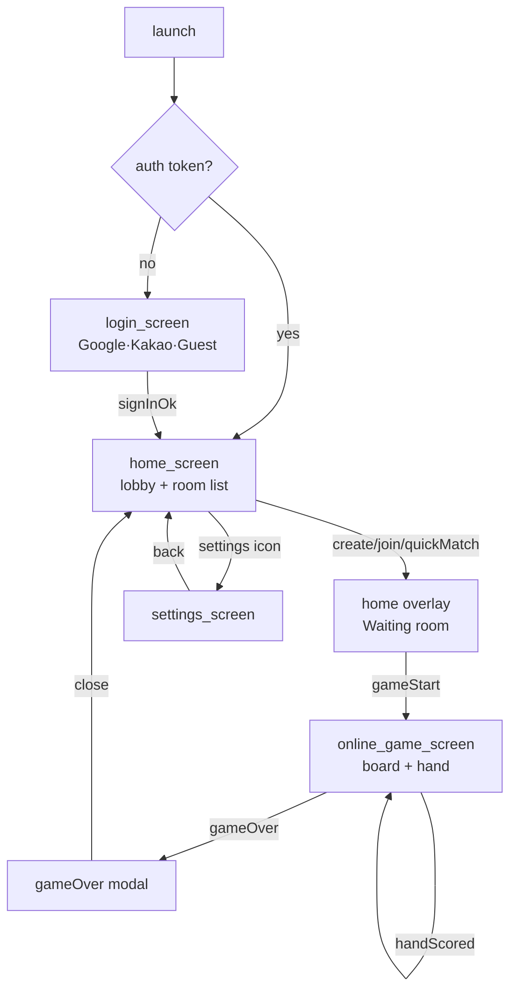

# UX 화면 흐름 PRD

> **Status**: Skeleton (v0.1) — 2026-04-17 작성
> **범위**: 화면 전이 · 상태 전이 · 에러 UX · 공백 상태 UX 계약
> **연관 PRD**: prd-game-rules, prd-effect-system, prd-realtime-protocol, prd-auth-security

## 개요

- **목적**: 4개 화면(login/home/game/settings)의 전이 규칙, `OnlineConnectionState` 상태별 UI 대응, 에러 코드별 UX 처리, 공백 상태(초기 로딩·방 없음·연결 없음) 표현을 계약으로 고정한다.
- **배경**: `docs/01-plan/prd-reinforcement-strategy.md` § D4에서 UX/화면 흐름 PRD 부재가 Gap으로 식별됨. 화면 전이 규칙이 코드에 암묵적으로 녹아있어 회귀 위험.
- **범위**: Flutter 웹 클라이언트 4개 화면만. 서버 프로토콜은 prd-realtime-protocol 소관.

## 전체 화면 흐름 (Flow)

> `login_screen.dart`는 `pushReplacementNamed('/home')`로 전이 (`login_screen.dart:48`, `:105`). `settings_screen`은 Stack에 push (`home_screen.dart:123-126`). `OnlineGameScreen`은 `playing` 상태 진입 시 push (`home_screen.dart:76-90`).

## OnlineConnectionState 상태 전이

`lib/providers/online_game_provider.dart:10-19` 정의된 enum 8개 값 전수.

| 상태 | 진입 조건 | UI 대응 | 다음 상태 |
|------|----------|---------|----------|
| `disconnected` | 초기 / `disconnect()` 호출 | "Not connected" + Connect 버튼 | `inLobby` (재연결) |
| `connecting` | `joinRoom()` 시작 | 로딩 오버레이 "Connecting..." | `inRoom` / `error` |
| `inLobby` | `connectLobby()` 성공 | 방 목록 + Create 버튼 활성화 | `connecting` |
| `inRoom` | `joinAccepted` 수신 | 로딩 오버레이 "Waiting for players..." + Start 버튼(호스트) | `playing` / `disconnected` |
| `playing` | `gameStart` 수신 | `OnlineGameScreen` push | `gameOver` / `reconnecting` |
| `gameOver` | `gameOver` 수신 | 결과 모달 | `inLobby` (복귀) |
| `reconnecting` | `_onConnectionLost()` 트리거 | "Reconnecting..." 배너 | `playing` / `error` |
| `error` | `errorMessage != null` 조건부 | SnackBar 토스트 + Retry 버튼 | `inLobby` (retry) |

> `home_screen.dart:36-41`에서 `inRoom/connecting/reconnecting/playing` 시 AppLifecycle resume 재연결 스킵. `home_screen.dart:91-99`에서 `error` 상태 SnackBar 노출.

## 화면별 상세

### login_screen.dart

**구성 요소** (`login_screen.dart:24-97`):
- 타이틀 "KFC Poker" + 부제 "Open Face Chinese Poker"
- Google 로그인 버튼 (`Icons.login` + "Google로 로그인") — `auth.isLoading` 시 disabled
- 구분선 "또는"
- 닉네임 TextField (maxLength 20) + 게스트로 입장 OutlinedButton
- 로딩 시 `CircularProgressIndicator`

**성공 흐름**: `signInWithGoogle()` / `signInAsGuest(name)` → `pushReplacementNamed('/home')` (`:48`, `:105`).

**실패 처리**: authProvider가 에러 상태 시 **현재 화면에 토스트 없음** (TODO — SnackBar 추가 필요).

**공백 상태**: 닉네임 빈 문자열 시 `_guestLogin()` early return (`:103`) — 버튼 비활성화 피드백 없음 (TODO).

### home_screen.dart

**로비 방 목록 실시간 업데이트** (`home_screen.dart:304-341`):
- `roomList` → 초기 목록
- `roomCreated` → append
- `roomUpdated` → 해당 roomId 교체
- `roomDeleted` → 필터링 제거

**방 생성/참가/빠른매칭 다이얼로그**:
- **Create** (`:514-666`): playerName · roomName · maxPlayers(2~6) · turnTimeLimit(0~120s) · password(optional). `inLobby` 상태에서만 버튼 노출 (`:158-172`).
- **Join** (`:301-313`): hasPassword 시 비밀번호 다이얼로그 선행 (`:315-351`).
- **Quick Match**: `quickMatch()` 제공되나 현재 UI 미노출 (`online_game_provider.dart:218-233`).

**비밀번호 방 잠금 아이콘** (`home_screen.dart:264`): `hasPassword == true` 시 `Icons.lock` amber.

**공백 상태**:
- `disconnected`/`error` → "Not connected" + Connect 버튼 (`:198-221`)
- `inLobby` + rooms 빈 배열 → "No rooms available" (`:224-231`)
- `inRoom` → 로딩 오버레이 + 플레이어 명단 + Start 버튼/대기 메시지 (`:353-512`)

### online_game_screen.dart

**보드 레이아웃** (`online_game_screen.dart:40-80`):
- Top(3) / Mid(5) / Bot(5) 3-lane 배치 (`BoardWidget`)
- 손패 (`HandWidget`) — 5장 초기 + 3장 Pineapple 라운드 2~5
- 점수판 (`_buildScorePanel` `:1312-1500`) — Semantics `score-bar`, `score-chip-{playerId}`

**턴 인디케이터 + 타이머** (`:185-280`):
- `isMyTurn == true` → green pulse `turn-indicator-my-turn` + "Your Turn!" / "Fantasyland"
- `isMyTurn == false` → gray `turn-indicator-waiting` + 현재 플레이어명
- `turnDeadline` 존재 시 `turn-timer` 프로그레스 바 (`serverTimeOffset` 보정)

**Fantasyland 모드 표시** (`:779-782`): `isInFantasyland == true` 시 `fantasyland-badge` Semantics + 14장 손패.

**이펙트 레이어**: `EffectManager` → `prd-effect-system.prd.md` 참조. `opponentCelebLines`로 2초간 라인 완성 축하 (`online_game_provider.dart:622-660`).

**handResult/gameOver 결과 모달**:
- `handScored` 수신 (`:632-680`) → 라운드 점수 다이얼로그 + `ready-button` (`_handScoredDialogContext` 관리).
- 다른 플레이어 ready 완료 시 `allPlayersReady` → 다이얼로그 자동 pop.
- `gameOver` 수신 (`:628-631`) → 최종 점수 모달 + home 복귀.

**Foul / 연출**: `_shakeController` + `_ShakeType.foul/celebration` (`:39-53`).

**에모트**: `EmotePicker` + `EmoteBubble` (`online_game_screen.dart:22-23`).

### settings_screen.dart

**구성 요소** (`settings_screen.dart:22-72`):
- Audio: Sound Effects toggle / Haptic Feedback toggle
- Player: 이름 편집 다이얼로그 (`_showNameDialog` `:99-136`)
- Appearance: Dark/Green/Blue 3-radio theme

**오디오 볼륨**: 현재 on/off 토글만 — **슬라이더 없음** (TODO). 서버 URL 입력은 `home_screen.dart:722-760`에 위치 (모바일 전용).

**버전 표시**: "OFC Pineapple v0.1.0" (`:75`).

## 에러 상태 UX

| Error Code / 트리거 | 서버 페이로드 | 클라이언트 UX | 참조 |
|--------------------|-------------|--------------|------|
| `INVALID_PASSWORD` | `{code, message}` | 비밀번호 다이얼로그 내 에러 표시 (TODO — 현재 토스트만) | `server/index.js:454` |
| 방 찾을 수 없음 | `{message: '방을 찾을 수 없습니다.'}` | SnackBar 토스트 | `server/index.js:269` |
| 플레이어 이름 초과 | `{message: '플레이어 이름은 50자 이하여야 합니다.'}` | SnackBar | `server/index.js:447` |
| 세션 만료 (rejoinRequired) | `{message, rejoinRequired: true}` | 자동 rejoin 시도 → 실패 시 home 복귀 | `server/index.js:501`, `online_game_provider.dart:854-865` |
| 재접속 실패 | `{message, rejoinRequired: true}` | reconnecting 배너 → error 상태 → Retry 버튼 | `server/index.js:495`, `online_game_provider.dart:866-871` |
| 연결 끊김 (WS close) | — (client-side) | `reconnecting` 배너 + 자동 재시도 | `online_game_provider.dart:826-872` |
| 방 삭제됨 | `roomDeleted` 메시지 | 방 목록에서 제거, 진입 중이면 home 복귀 (TODO 명시 필요) | `online_game_provider.dart:333-339` |
| 타 플레이어 타임아웃 | `playerLeft {reason: 'timeout'}` | "Player left the game (timeout)" 토스트 | `online_game_provider.dart:661-669` |

> **TODO**: `ROOM_FULL` 에러 코드 미정의. 서버가 일반 메시지로 처리 중 — 코드 표준화 필요.

## 접근성

**Semantics 라벨 전수** (회귀 방지용):
- `home_screen.dart`: `create-room-button` (`:161`), `room-item-{roomId}` (`:258`), `join-room-button` (`:278`), `start-game-button` (`:406`), `player-name-input` (`:546`, `:677`)
- `online_game_screen.dart`: `turn-indicator-my-turn`/`-waiting` (`:188`, `:221`), `turn-timer` (`:259`), `fantasyland-badge` (`:781`), `folded-banner` (`:862`), `undo-button`/`confirm-button` (`:977`, `:1011`), `score-bar`/`score-chip-{id}`/`score-player-{id}` (`:1313`, `:1344`, `:1484`), `ready-button` (`:1617`)

**키보드 접근**:
- 카드 드래그 기반 배치 → 키보드/스위치 접근 수단 없음 (**TODO**: 탭-투-셀렉트 대체 플로우).
- 다이얼로그 TextField `autofocus: true` + `onSubmitted` 지원 (로그인/이름/비밀번호).

**Semantics 강제 활성화**: `main.dart:10` `SemanticsBinding.instance.ensureSemantics()` — CanvasKit에서도 DOM 생성.

## 다국어/로컬라이제이션

- 현재 **한국어 전용 문자열 하드코딩**. "게스트로 입장", "방 비밀번호", "방을 찾을 수 없습니다." 등 서버/클라이언트 모두 한국어.
- 영어 UI 병존 ("Create Room", "Join", "Start Game", "Waiting for host to start..." 등) — 혼용 상태.
- **TODO**: `flutter_localizations` + ARB 파일 도입, 서버 에러 메시지 i18n 키 응답 (코드 유지).

## 구현 맵

| 화면 | 파일 | 라인 |
|------|------|------|
| Login | `lib/ui/screens/login_screen.dart` | 1-107 |
| Home (lobby) | `lib/ui/screens/home_screen.dart` | 1-771 |
| Home (room overlay) | `lib/ui/screens/home_screen.dart` | 353-512 |
| Game board | `lib/ui/screens/online_game_screen.dart` | 1-1700+ |
| Settings | `lib/ui/screens/settings_screen.dart` | 1-137 |
| Routing | `lib/main.dart` | 37-41 |
| State enum | `lib/providers/online_game_provider.dart` | 10-19 |
| Message handler | `lib/providers/online_game_provider.dart` | 343-671 |

## 범위 외

- 게임 규칙 (scoring / royalties / foul 판정) → `prd-game-rules.prd.md`
- 이펙트 타이밍 · 강도 · 샘플링 → `prd-effect-system.prd.md`
- WebSocket 프로토콜 메시지 타입 → `prd-realtime-protocol.prd.md`
- 인증 토큰 발급 · 갱신 정책 → `prd-auth-security.prd.md`

## DoD

- [ ] 모든 화면 전이가 위젯 테스트 / E2E로 검증 (`flutter test` + Playwright)
- [ ] `OnlineConnectionState` 8개 값 × UI 대응 표 100% 매칭
- [ ] 에러 코드 표의 모든 항목에 대응 UX 검증 케이스 존재
- [ ] 공백 상태 3종(초기 로딩, 방 없음, 연결 없음) 스크린샷 첨부
- [ ] Semantics 라벨 전수에 대한 접근성 회귀 테스트
- [ ] TODO 3건(로그인 실패 토스트, 키보드 접근, i18n) 별도 티켓 등록

## Changelog

| 날짜 | 버전 | 변경 내용 | 변경 유형 | 결정 근거 |
|------|------|-----------|----------|----------|
| 2026-04-17 | v0.1 | Skeleton 최초 작성. 4개 화면 + 8개 상태 + 에러 8종 계약화 | - | D4 Gap 해소 (prd-reinforcement-strategy § D4) |
