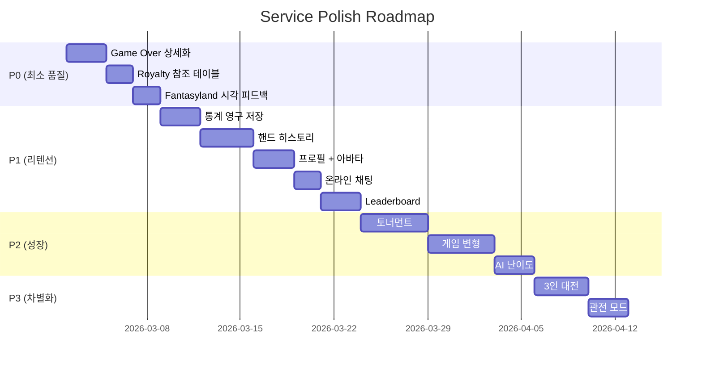
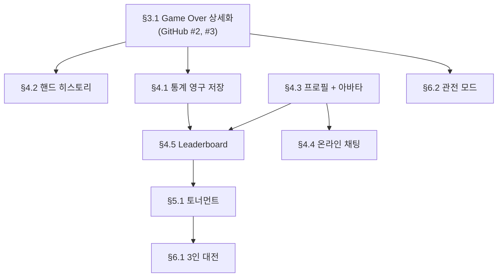

# Service Polish PRD

**버전**: 1.0
**작성일**: 2026-03-01
**상태**: 작성 완료
**목적**: OFC Pineapple 서비스 완성도를 경쟁사 수준으로 끌어올리기 위한 기능 개선 및 신규 기능 정의

---

## 목차

1. [개요](#1-개요)
2. [우선순위 체계](#2-우선순위-체계)
3. [P0 — 서비스 최소 품질](#3-p0--서비스-최소-품질)
4. [P1 — 완성도 + 리텐션](#4-p1--완성도--리텐션)
5. [P2 — 성장 + 수익화](#5-p2--성장--수익화)
6. [P3 — 차별화](#6-p3--차별화)
7. [기술 요구사항](#7-기술-요구사항)
8. [구현 상태](#8-구현-상태)
9. [Changelog](#changelog)

---

## 1. 개요

### 1.1 목적

OFC Pineapple 게임의 핵심 로직과 온라인 멀티플레이어 인프라가 완성된 상태에서, 서비스 품질을 경쟁사 수준으로 끌어올린다. Game Over 화면 상세화, Royalty 참조 테이블, Fantasyland 시각 피드백 등 **최소 서비스 품질(P0)**을 우선 확보하고, 단계적으로 리텐션/성장/차별화 기능을 추가한다.

### 1.2 배경

**현재 완성 상태**:
- Python 게임 로직: 423 tests ALL PASS
- Flutter 클라이언트: 144 tests ALL PASS (VS AI, 2P Local, Online)
- 온라인 멀티플레이어: Docker 서버 + WebSocket + 재접속 + Public Room Listing
- 관련 PRD: `layer0-ofc.prd.md` (v1.5), `online-multiplayer.prd.md` (v3.5)

**경쟁사 분석 (2026-03)**:

| 앱 | 특징 | 강점 | 약점 |
|----|------|------|------|
| **Pineapple!** (Pineapple Games Ltd.) | 업계 최고, Pro $14.99~24.99/월 | RNG 인증, 3인 지원, Fantasyland 완벽 | 높은 구독료 |
| **Untapped OFC** | 가장 포괄적 통계 | 8가지 변형, Ledger, 핸드 리플레이 | UI 다소 복잡 |
| **Raccoons OFC** | 유일한 토너먼트 | 웹+모바일, AI 훈련 | 규모 작음 |
| **DH Pineapple** | 개발 중단 (2020) | 과거 인기 | 미지원 |

**Gap 분석 요약**:

| 영역 | 우리 앱 현재 상태 | 경쟁사 표준 |
|------|-------------------|------------|
| Game Over 결과 | 총점만 표시 | 라인별 결과 + Royalty 상세 + 보드 스냅샷 |
| lineResults 서버 | 빈 객체 반환 (GitHub #2) | 라인별 승패 + 점수 분해 |
| Royalty 참조 | 없음 | 게임 중 접근 가능한 테이블 |
| Fantasyland 피드백 | 없음 | 달성 알림 + 딜링 시각화 |
| 통계 저장 | 메모리만 (세션 종료 시 소멸) | 영구 저장 + 상세 분석 |
| 핸드 히스토리 | 없음 | 리플레이 가능 |
| 프로필/아바타 | 없음 (닉네임만) | 프로필 + 아바타 |
| 채팅 | 없음 | 인게임 채팅 |
| Leaderboard | 없음 | 랭킹 시스템 |

### 1.3 범위

**본 PRD 포함**:
- P0~P3 우선순위별 기능 정의 및 수용 기준
- 서버/클라이언트/인프라 기술 요구사항
- GitHub Issues #2, #3, #4 연동

**본 PRD 제외**:
- Layer 1+ 커스텀 규칙 (경제, 별 강화, HP/데미지)
- 네이티브 앱 스토어 배포 절차
- 결제 시스템 구현 상세 (P2에서 방향만 정의)

### 1.4 우선순위 로드맵



---

## 2. 우선순위 체계

### 2.1 분류 기준

| 등급 | 명칭 | 기준 | 목표 |
|------|------|------|------|
| **P0** | 서비스 최소 품질 | 현재 버그 수정 + 게임 결과를 이해할 수 없는 수준의 UX 결함 | 사용자가 게임 결과를 정확히 이해하고, 규칙을 참조할 수 있음 |
| **P1** | 완성도 + 리텐션 | 경쟁사 표준 기능 중 사용자 재방문에 직접 영향 | 일간 활성 사용자(DAU) 리텐션 증가 |
| **P2** | 성장 + 수익화 | 사용자 풀 확대 및 수익 모델 도입 | MAU 성장 + 매출 발생 |
| **P3** | 차별화 | 경쟁사 대비 고유 가치 제공 | 경쟁 우위 확보 |

### 2.2 의존성 관계



| 선행 | 후행 | 이유 |
|------|------|------|
| §3.1 Game Over 상세화 | §4.2 핸드 히스토리 | lineResults 데이터가 있어야 리플레이 가능 |
| §3.1 Game Over 상세화 | §4.1 통계 영구 저장 | 상세 점수 데이터가 있어야 의미 있는 통계 |
| §4.1 통계 영구 저장 | §4.5 Leaderboard | 누적 데이터 기반 랭킹 |
| §4.3 프로필 + 아바타 | §4.5 Leaderboard | 랭킹에 프로필 표시 필요 |
| §4.3 프로필 + 아바타 | §4.4 온라인 채팅 | 채팅에 아바타 표시 |
| §4.5 Leaderboard | §5.1 토너먼트 | 토너먼트 참가 자격/시드 기반 |

---

## 3. P0 — 서비스 최소 품질

### 3.1 Game Over 상세화

> **GitHub Issues**: #2 (lineResults empty), #3 (Game Over 상세화)

#### 3.1.1 lineResults 서버 수정 (GitHub #2)

**AS-IS**: `_score_game()` 에서 `lineResults`가 빈 객체 `{}` 로 반환된다. 라인별 비교 결과가 클라이언트에 전달되지 않아 Game Over 화면에서 상세 점수 분해가 불가능하다.

**TO-BE**: 각 플레이어 쌍에 대해 라인별 비교 결과를 포함한 상세 데이터를 반환한다.

**lineResults 응답 스키마**:

```json
{
  "type": "gameOver",
  "results": {
    "player_id_1": {
      "name": "Player1",
      "totalScore": 12,
      "foul": false,
      "royalty": 4,
      "board": { "top": [...], "mid": [...], "bottom": [...] },
      "lineResults": {
        "player_id_2": {
          "top": { "result": "win", "score": 1, "myHand": "ONE_PAIR", "oppHand": "HIGH_CARD" },
          "mid": { "result": "win", "score": 1, "myHand": "FLUSH", "oppHand": "STRAIGHT" },
          "bottom": { "result": "win", "score": 1, "myHand": "FULL_HOUSE", "oppHand": "TWO_PAIR" },
          "lineTotal": 3,
          "scoop": true,
          "scoopBonus": 3,
          "royaltyDiff": 4,
          "pairTotal": 10
        }
      }
    }
  },
  "scores": { "player_id_1": 12, "player_id_2": -12 }
}
```

**수정 대상 파일**:

| 파일 | 변경 내용 |
|------|-----------|
| `server/game_session.py` — `_score_game()` | lineResults에 라인별 비교 결과 (`result`, `score`, `myHand`, `oppHand`) 추가 |
| `server/game_session.py` — `_compare_boards()` | 반환값을 `int`에서 `dict`로 확장 (총점 + 라인별 상세) |

**수용 기준**:
- [ ] `_score_game()` 반환값의 `lineResults`가 각 상대별 라인 비교 결과를 포함한다
- [ ] 각 라인 결과에 `result` (win/lose/draw), `score` (+1/-1/0), `myHand`, `oppHand` 포함
- [ ] Scoop 여부(`scoop`), Scoop 보너스(`scoopBonus`), Royalty 차이(`royaltyDiff`) 포함
- [ ] Foul 시 lineResults는 `null` 또는 foul 전용 메시지
- [ ] `tests/test_online_server.py`에 lineResults 검증 테스트 추가 (최소 3개)

#### 3.1.2 Game Over UI 리디자인 (GitHub #3)

**AS-IS**: 온라인 Game Over는 `AlertDialog`에 플레이어명 + 총점 + Foul 여부만 표시한다. 오프라인 Game Over는 `GameOverScreen`에 승자 + 총점만 표시한다. 어떤 라인에서 이겼는지, Royalty가 얼마인지, Scoop이 발생했는지 알 수 없다.

**TO-BE**: 전체 화면 Game Over 스크린으로 전환하여 다음 정보를 표시한다:

```
+--------------------------------------------------+
|              GAME OVER                            |
|                                                   |
|  [Trophy] Player1 Wins! (+12 pts)                 |
|                                                   |
|  +----- Board Snapshot --------+                  |
|  | P1 Board    vs    P2 Board  |                  |
|  | Top:  [Ah Kh Qh]   [Jc Tc 9c] |               |
|  | Mid:  [...]         [...]   |                  |
|  | Back: [...]         [...]   |                  |
|  +-----------------------------+                  |
|                                                   |
|  +--- Score Breakdown ---------+                  |
|  | Line   | P1         | P2    | Result          |
|  |--------|------------|-------|-----------------|
|  | Top    | ONE_PAIR   | HIGH  | P1 Win (+1)    |
|  | Mid    | FLUSH      | STR   | P1 Win (+1)    |
|  | Back   | FH         | 2P    | P1 Win (+1)    |
|  |--------|------------|-------|-----------------|
|  | Lines  |            |       | +3             |
|  | Scoop  |            |       | +3             |
|  | Royal. | +4         | +0    | +4             |
|  | TOTAL  |            |       | +10            |
|  +-----------------------------+                  |
|                                                   |
|  [Rematch]              [Home]                    |
+--------------------------------------------------+
```

**수정 대상 파일**:

| 파일 | 변경 내용 |
|------|-----------|
| `card_ofc_flutter/lib/ui/screens/online_game_screen.dart` | `_showGameOverDialog` → 전체 화면 Game Over 스크린으로 네비게이션 전환 |
| `card_ofc_flutter/lib/ui/screens/game_over_screen.dart` | 라인별 결과, Royalty 상세, 보드 스냅샷 표시로 리디자인 |
| `card_ofc_flutter/lib/ui/widgets/score_breakdown_widget.dart` | 신규 — 라인별 점수 분해 테이블 위젯 (재활용) |
| `card_ofc_flutter/lib/ui/widgets/board_snapshot_widget.dart` | 신규 — 양쪽 보드 나란히 표시하는 읽기 전용 위젯 |

**수용 기준**:
- [ ] 온라인/오프라인 모두 Game Over 시 전체 화면으로 전환된다
- [ ] 양쪽 보드 스냅샷이 나란히 표시된다
- [ ] 라인별 승패 결과 (win/lose/draw)가 핸드 타입과 함께 표시된다
- [ ] Scoop 보너스, Royalty 상세가 점수 분해 테이블에 표시된다
- [ ] Foul 발생 시 해당 플레이어 보드에 Foul 마크가 표시된다
- [ ] Rematch (온라인: 새 방 생성) / Home 버튼이 동작한다

#### 3.1.3 양쪽 보드 스냅샷

**AS-IS**: Game Over 시점에 보드 상태가 사라진다. 플레이어는 최종 배치를 확인할 수 없다.

**TO-BE**: 서버가 `gameOver` 메시지에 양쪽 보드 데이터를 포함하여 전송한다 (이미 `_score_game()`에서 `board` 필드로 전송 중). 클라이언트가 이를 파싱하여 읽기 전용 보드 스냅샷으로 표시한다.

**수용 기준**:
- [ ] Game Over 결과에 모든 플레이어의 보드 데이터가 포함된다 (현재 구현 확인)
- [ ] 클라이언트가 보드 데이터를 파싱하여 카드 이미지/텍스트로 표시한다
- [ ] 보드 스냅샷은 읽기 전용 (드래그/탭 이벤트 없음)

### 3.2 Royalty 참조 테이블

**AS-IS**: 플레이어가 게임 중 Royalty 점수 기준을 확인할 방법이 없다. 튜토리얼 화면에도 Royalty 테이블이 포함되어 있지 않다. 초보 사용자는 어떤 핸드가 추가 점수를 주는지 알 수 없어 전략적 배치가 불가능하다.

**TO-BE**: 게임 화면에서 접근 가능한 Royalty 참조 테이블을 제공한다.

**Royalty 테이블 내용** (PRD `layer0-ofc.prd.md` §2.7 기준):

| 라인 | 핸드 | 점수 |
|------|------|------|
| **Bottom** | Straight | +2 |
| | Flush | +4 |
| | Full House | +6 |
| | Four of a Kind | +10 |
| | Straight Flush | +15 |
| | Royal Flush | +25 |
| **Mid** | Three of a Kind | +2 |
| | Straight | +4 |
| | Flush | +8 |
| | Full House | +12 |
| | Four of a Kind | +20 |
| | Straight Flush | +30 |
| | Royal Flush | +50 |
| **Top** | 66 | +1 |
| | 77~AA | +2~+9 |
| | Trip 2s~Trip Aces | +10~+22 |

**UI 접근 방식**:
- **게임 화면 AppBar**에 `[?]` 아이콘 버튼 추가
- 탭 시 하단 시트(Bottom Sheet) 또는 다이얼로그로 Royalty 테이블 표시
- 3개 탭 (Bottom / Mid / Top) 또는 단일 스크롤 뷰

**수정 대상 파일**:

| 파일 | 변경 내용 |
|------|-----------|
| `card_ofc_flutter/lib/ui/widgets/royalty_table_widget.dart` | 신규 — Royalty 참조 테이블 위젯 |
| `card_ofc_flutter/lib/ui/screens/game_screen.dart` | AppBar에 `[?]` 버튼 + Bottom Sheet 호출 |
| `card_ofc_flutter/lib/ui/screens/online_game_screen.dart` | 동일하게 `[?]` 버튼 추가 |

**수용 기준**:
- [ ] 게임 화면(오프라인/온라인)에서 Royalty 테이블에 접근 가능하다
- [ ] Bottom/Mid/Top 라인별 모든 Royalty 조건과 점수가 표시된다
- [ ] PRD §2.7과 데이터가 100% 일치한다
- [ ] 테이블이 게임 진행을 방해하지 않는다 (오버레이/시트 방식)

### 3.3 Fantasyland 시각 피드백

**AS-IS**: Fantasyland 진입 조건(Top QQ+)을 달성해도 시각적 알림이 없다. FL 핸드 딜링 시 14~17장을 한꺼번에 받지만 일반 딜링과 시각적으로 구분되지 않는다. FL badge가 `GameScreen`에 있으나 눈에 띄지 않는다.

**TO-BE**: Fantasyland 달성/딜링 시 명확한 시각적 피드백을 제공한다.

**기능 상세**:

| 기능 | 설명 |
|------|------|
| **FL 달성 알림** | Top QQ+ 배치 완성 시 화면 중앙에 "FANTASYLAND!" 오버레이 애니메이션 (2초 후 자동 소멸) |
| **FL 딜링 시각화** | 14~17장 한꺼번에 받을 때 카드 팬(Fan) 펼침 애니메이션 + 장 수 표시 ("14 Cards Dealt!") |
| **FL 진입 조건 표시** | Top 라인에 QQ+ 조건에 근접할 때 (예: Q 1장 배치 시) 힌트 마크 표시 |
| **Re-FL 알림** | Re-Fantasyland 유지 성공 시 "RE-FANTASYLAND!" 표시 |

**수정 대상 파일**:

| 파일 | 변경 내용 |
|------|-----------|
| `card_ofc_flutter/lib/ui/widgets/fantasyland_overlay.dart` | 신규 — FL 달성/Re-FL 오버레이 애니메이션 |
| `card_ofc_flutter/lib/ui/screens/game_screen.dart` | FL 달성 감지 시 오버레이 트리거 |
| `card_ofc_flutter/lib/ui/screens/online_game_screen.dart` | 서버 FL 알림 수신 시 오버레이 표시 |
| `card_ofc_flutter/lib/ui/widgets/hand_widget.dart` | FL 딜링 시 카드 장 수 표시 |
| `server/game_session.py` | FL 진입 조건 달성 시 `fantasylandTriggered` 메시지 추가 |

**수용 기준**:
- [ ] Top QQ+ 달성 시 "FANTASYLAND!" 오버레이가 표시된다
- [ ] FL 딜링 시 카드 장 수 (14/15/16/17)가 화면에 명확히 표시된다
- [ ] Re-FL 유지 성공 시 별도 알림이 표시된다
- [ ] 오버레이 애니메이션이 2초 이내에 자동 소멸하여 게임 진행을 방해하지 않는다
- [ ] 온라인 모드에서 서버 FL 이벤트와 클라이언트 표시가 동기화된다

---

## 4. P1 — 완성도 + 리텐션

### 4.1 통계 영구 저장

**AS-IS**: `StatsService`가 메모리에만 통계를 보관한다. 앱 종료 시 모든 데이터가 소멸한다. 경쟁사(Untapped OFC)는 승률, Foul 비율, Royalty 달성 빈도, Fantasyland 진입률 등 상세 통계를 영구 저장한다.

**TO-BE**: 로컬 영구 저장소에 핸드별 결과를 기록하고, 누적 통계를 제공한다.

**저장 데이터**:

| 항목 | 타입 | 설명 |
|------|------|------|
| `totalHands` | int | 총 플레이 핸드 수 |
| `wins` / `losses` / `draws` | int | 승/패/무 (Pairwise 기준) |
| `fouls` | int | Foul 횟수 |
| `scoops` | int | Scoop 달성 횟수 |
| `fantasylandEntries` | int | FL 진입 횟수 |
| `totalRoyalty` | int | 누적 Royalty 점수 |
| `avgScore` | double | 평균 핸드 점수 |
| `bestHand` | Map | 최고 핸드 기록 (라인, 핸드 타입, 점수) |
| `lineWinRates` | Map | 라인별 승률 (top/mid/bottom) |

**저장 방식**: `shared_preferences` (모바일/웹 모두 지원) 또는 `hive` (구조화 데이터)

**수정 대상 파일**:

| 파일 | 변경 내용 |
|------|-----------|
| `card_ofc_flutter/lib/services/stats_service.dart` | 영구 저장소 연동 (load/save), 상세 통계 필드 추가 |
| `card_ofc_flutter/lib/ui/screens/stats_screen.dart` | 신규 또는 기존 확장 — 상세 통계 표시 화면 |
| `card_ofc_flutter/pubspec.yaml` | `shared_preferences` 또는 `hive` 추가 |

**수용 기준**:
- [ ] 앱 재시작 후에도 통계가 유지된다
- [ ] 승률, Foul 비율, 평균 점수, FL 진입률이 정확히 계산된다
- [ ] 통계 화면에서 누적/최근 N핸드 필터가 가능하다

### 4.2 핸드 히스토리 / 리플레이

**AS-IS**: 핸드 종료 후 결과 데이터가 유실된다. 과거 핸드를 되돌아보거나 배치 과정을 재현할 수 없다. Untapped OFC는 모든 핸드를 리플레이 가능하며, 라인별 분석을 제공한다.

**TO-BE**: 각 핸드의 전체 배치 시퀀스를 저장하고, 턴별 리플레이 기능을 제공한다.

**저장 데이터 (핸드당)**:

| 항목 | 설명 |
|------|------|
| `handId` | 고유 핸드 식별자 (UUID) |
| `timestamp` | 핸드 시작 시각 |
| `mode` | VS AI / 2P Local / Online |
| `players` | 플레이어 목록 + 최종 점수 |
| `rounds[]` | R0~R4 각 라운드의 딜링 카드 + 배치 + 버림 시퀀스 |
| `finalBoards` | 최종 보드 상태 |
| `scoreBreakdown` | 라인별 점수 분해 (§3.1 lineResults 포맷) |

**리플레이 UI**:
- 히스토리 목록에서 핸드 선택
- 라운드별 전진/후진 버튼
- 각 라운드의 딜링 카드, 배치 위치, 버린 카드 시각화
- 최종 보드 + 점수 분해 표시

**수정 대상 파일**:

| 파일 | 변경 내용 |
|------|-----------|
| `card_ofc_flutter/lib/models/hand_history.dart` | 신규 — HandHistory freezed 모델 |
| `card_ofc_flutter/lib/services/history_service.dart` | 신규 — 히스토리 저장/로드 서비스 |
| `card_ofc_flutter/lib/ui/screens/history_screen.dart` | 신규 — 히스토리 목록 + 리플레이 화면 |
| `card_ofc_flutter/lib/providers/game_provider.dart` | 매 라운드 배치 시퀀스 기록 hook 추가 |

**수용 기준**:
- [ ] 각 핸드의 전체 배치 시퀀스가 로컬에 저장된다
- [ ] 히스토리 목록에서 최근 100핸드 이상 조회 가능하다
- [ ] 리플레이 시 라운드별 전진/후진이 가능하다
- [ ] 의존성: §3.1 lineResults 완료 후 구현 가능

### 4.3 프로필 + 아바타

**AS-IS**: 온라인 플레이어는 닉네임만 사용한다. 시각적 식별이 어렵고, 프로필 정보가 없다.

**TO-BE**: 기본 프로필 시스템을 제공한다.

**기능 상세**:

| 항목 | 설명 |
|------|------|
| **닉네임** | 기존 유지 (MVP: 서버 인증 없이 클라이언트 로컬 저장) |
| **아바타** | 사전 정의 아이콘 12~20종 선택 (카드 수트, 동물 등) |
| **프로필 카드** | 닉네임 + 아바타 + 통계 요약 (승률, FL 진입률) |
| **게임 내 표시** | 상대 이름 옆에 아바타 아이콘 |

**아바타 에셋**: Flutter 기본 `Icons` 또는 간단한 SVG 에셋 (빌드 크기 최소화)

**수정 대상 파일**:

| 파일 | 변경 내용 |
|------|-----------|
| `card_ofc_flutter/lib/models/player_profile.dart` | 신규 — PlayerProfile freezed 모델 |
| `card_ofc_flutter/lib/providers/profile_provider.dart` | 신규 — 프로필 로드/저장 (shared_preferences) |
| `card_ofc_flutter/lib/ui/screens/profile_screen.dart` | 신규 — 프로필 편집 화면 |
| `card_ofc_flutter/lib/ui/screens/home_screen.dart` | 프로필 아이콘 진입점 추가 |
| `server/models.py` | Room 참가자에 avatar 필드 추가 (optional) |

**수용 기준**:
- [ ] 플레이어가 닉네임과 아바타를 설정하고 영구 저장할 수 있다
- [ ] 온라인 게임에서 상대에게 아바타가 표시된다
- [ ] 프로필 화면에서 통계 요약이 표시된다 (§4.1 의존)

### 4.4 온라인 채팅

**AS-IS**: 온라인 대전 중 상대와 소통할 방법이 없다. 경쟁사는 최소한 이모지 또는 정형화된 메시지(Quick Chat)를 제공한다.

**TO-BE**: 게임 중 Quick Chat 기능을 제공한다.

**기능 상세**:

| 기능 | 설명 |
|------|------|
| **Quick Chat** | 사전 정의 메시지 8~12종 (예: "Good luck!", "Nice hand!", "Oops!", "GG") |
| **이모지 리액션** | 카드 배치 시 실시간 이모지 반응 (optional Phase 2) |
| **자유 채팅** | 텍스트 입력 (optional, 비속어 필터 필요) |

**MVP 범위**: Quick Chat만 (자유 채팅은 P2+ 고려)

**프로토콜 확장**:

| 메시지 타입 | 방향 | 페이로드 |
|------------|------|---------|
| `chatMessage` | Client→Server | `{type: "chatMessage", message: "Nice hand!"}` |
| `chatBroadcast` | Server→Clients | `{type: "chatBroadcast", playerId, playerName, message}` |

**수정 대상 파일**:

| 파일 | 변경 내용 |
|------|-----------|
| `server/main.py` | `chatMessage` 핸들러 추가, 상대에게 브로드캐스트 |
| `card_ofc_flutter/lib/network/online_client.dart` | `sendChat()`, `chatMessages` stream 추가 |
| `card_ofc_flutter/lib/ui/widgets/quick_chat_widget.dart` | 신규 — Quick Chat 패널 |
| `card_ofc_flutter/lib/ui/screens/online_game_screen.dart` | Quick Chat 버튼 + 수신 메시지 표시 |

**수용 기준**:
- [ ] 게임 화면에서 Quick Chat 메시지를 전송할 수 있다
- [ ] 상대의 Quick Chat 메시지가 화면에 일시적으로 표시된다 (3초 후 소멸)
- [ ] 메시지 전송/수신이 200ms 이내로 처리된다

### 4.5 Leaderboard

**AS-IS**: 플레이어 간 랭킹/순위가 없다. 경쟁사(Raccoons OFC)는 시즌별 리더보드를 운영한다.

**TO-BE**: 서버 기반 온라인 리더보드를 제공한다.

**기능 상세**:

| 항목 | 설명 |
|------|------|
| **랭킹 기준** | 누적 점수 (Pairwise totalScore 합산) |
| **시즌** | 월간 리셋 (Optional: 올타임 + 시즌) |
| **표시 항목** | 순위, 닉네임, 아바타, 총 점수, 핸드 수, 승률 |
| **탑 N** | 상위 100명 + 본인 순위 표시 |

**인프라 요구사항**: 서버 측 영구 저장소 필요 (§7.3 참조)

**수정 대상 파일**:

| 파일 | 변경 내용 |
|------|-----------|
| `server/main.py` | `GET /api/leaderboard` REST API 추가 |
| `server/leaderboard.py` | 신규 — 리더보드 데이터 관리 (SQLite 또는 JSON) |
| `card_ofc_flutter/lib/ui/screens/leaderboard_screen.dart` | 신규 — 리더보드 표시 화면 |
| `card_ofc_flutter/lib/network/online_client.dart` | `getLeaderboard()` API 호출 추가 |

**수용 기준**:
- [ ] 온라인 게임 결과가 서버 리더보드에 반영된다
- [ ] 리더보드 화면에서 상위 100명 + 본인 순위가 표시된다
- [ ] 의존성: §4.1 통계 + §4.3 프로필 완료 후 구현

---

## 5. P2 — 성장 + 수익화

### 5.1 토너먼트 시스템

경쟁사 중 Raccoons OFC만 토너먼트를 지원한다. 토너먼트 기능은 사용자 참여를 크게 높이는 핵심 성장 동력이다.

**기능 상세**:

| 항목 | 설명 |
|------|------|
| **형식** | Sit-and-Go (SNG) — 참가자 모이면 즉시 시작 |
| **규모** | 4인, 8인 SNG (1:1 대전 토너먼트 브래킷) |
| **핸드 수** | 라운드당 3~5핸드, 누적 점수로 승자 결정 |
| **매칭** | 서버 자동 매칭 (대기열 → 토너먼트 방 자동 생성) |
| **결과** | 순위 + 랭킹 포인트 반영 |

**서버 확장**:
- `server/tournament.py`: 토너먼트 관리 (생성, 브래킷, 매칭, 결과)
- `server/main.py`: `/api/tournaments` REST + `/ws/tournament/{id}` WebSocket

**수용 기준**:
- [ ] 4인/8인 SNG 토너먼트 생성 및 참가 가능
- [ ] 브래킷 자동 생성 및 라운드 진행
- [ ] 토너먼트 결과가 리더보드에 반영
- [ ] 의존성: §4.5 Leaderboard 완료 후

### 5.2 게임 변형

Untapped OFC는 8가지 게임 변형을 지원하여 사용자 다양성을 확보한다.

**단계적 변형 추가**:

| 변형 | 설명 | 우선순위 |
|------|------|---------|
| **Progressive Pineapple** | FL 카드 수가 Top 핸드 강도에 비례 (현재 구현 완료) | 완료 |
| **Regular OFC** | Pineapple 아닌 클래식 OFC (R0: 5장, 이후 1장씩) | 높음 |
| **2-7 Pineapple** | Back에 2-7 로우 핸드 (최약이 최강) | 중간 |
| **Turbo** | R0: 7장 (5배치+2버림), R1~R3: 3장 (총 4라운드) | 중간 |
| **Deuce-to-Seven** | 3라인 모두 로우 핸드 기준 | 낮음 |

**수정 대상**: 게임 세션 생성 시 `variant` 파라미터 추가. 각 변형별 `GameSession` 서브클래스 또는 전략 패턴.

**수용 기준**:
- [ ] 방 생성 시 게임 변형을 선택할 수 있다
- [ ] Regular OFC가 첫 번째 추가 변형으로 구현된다
- [ ] 변형별 규칙 차이가 서버/클라이언트 모두에서 검증된다

### 5.3 AI 난이도 조절

**AS-IS**: `SimpleAI`가 단일 난이도로 동작한다. 초보자에게는 너무 어렵거나, 숙련자에게는 너무 쉬울 수 있다. Raccoons OFC는 AI 훈련 모드를 제공한다.

**TO-BE**: 3단계 AI 난이도를 제공한다.

| 난이도 | 전략 | 설명 |
|--------|------|------|
| **Easy** | 랜덤 배치 + 기본 Foul 회피 | 초보자용 |
| **Normal** | 현재 SimpleAI (핸드 강도 기반 배치) | 중급자용 |
| **Hard** | Monte Carlo 시뮬레이션 + Royalty 최적화 | 숙련자용 |

**수정 대상 파일**:

| 파일 | 변경 내용 |
|------|-----------|
| `card_ofc_flutter/lib/logic/simple_ai.dart` | Easy/Normal/Hard 분기 로직 |
| `card_ofc_flutter/lib/logic/hard_ai.dart` | 신규 — Monte Carlo AI |
| `card_ofc_flutter/lib/ui/screens/home_screen.dart` | VS AI 시작 시 난이도 선택 UI |
| `card_ofc_flutter/lib/providers/settings_provider.dart` | AI 난이도 설정 저장 |

**수용 기준**:
- [ ] VS AI 시작 시 Easy/Normal/Hard 난이도를 선택할 수 있다
- [ ] Easy AI는 Foul 비율이 높고 (>30%), Hard AI는 낮다 (<5%)
- [ ] Hard AI가 Royalty 달성 빈도에서 Normal보다 우수하다

### 5.4 Pro 구독 모델

Pineapple!은 Pro 구독 $14.99~24.99/월로 수익을 창출한다. 우리 앱에서도 프리미엄 기능을 분리하여 수익 기반을 마련한다.

**Free vs Pro 기능 분리**:

| 기능 | Free | Pro |
|------|------|-----|
| VS AI (Easy/Normal) | O | O |
| VS AI (Hard) | X | O |
| 온라인 대전 | 일 3회 | 무제한 |
| 핸드 히스토리 | 최근 10핸드 | 무제한 |
| 상세 통계 | 기본 | 전체 |
| 토너먼트 | X | O |
| 광고 | O | X |
| 게임 변형 | Pineapple만 | 전체 |

**가격 체계 (참고)**:

| 플랜 | 가격 (월) | 비고 |
|------|-----------|------|
| Free | $0 | 기본 기능 + 광고 |
| Pro Monthly | $4.99 | 모든 기능 |
| Pro Annual | $29.99 ($2.50/월) | 연간 할인 |

**구현 방향**: RevenueCat 또는 Firebase In-App Purchases. 상세 결제 구현은 별도 PRD.

**수용 기준**:
- [ ] Free/Pro 기능 차이가 명확히 구현된다
- [ ] Pro 전용 기능에 접근 시 업그레이드 안내가 표시된다
- [ ] 별도 결제 PRD 작성 후 구현

---

## 6. P3 — 차별화

### 6.1 3인 대전

**AS-IS**: 온라인 대전은 1:1만 지원한다 (서버 `max_players=2`). PRD `layer0-ofc.prd.md` §2.6은 3인 Pairwise 점수 계산을 정의하고 있으나 구현되지 않았다.

**TO-BE**: 3인 온라인 대전을 지원한다.

**기능 상세**:

| 항목 | 설명 |
|------|------|
| **방 생성** | `max_players=3` 옵션 추가 |
| **점수 계산** | 3쌍 Pairwise (A vs B, A vs C, B vs C) 독립 계산 |
| **UI** | 상대 2명 보드 표시 (상단 좌/우) |
| **덱** | 52장으로 3인 대전 시 카드 부족 없음 (3x13=39장 사용, 13장 잔여) |

**서버 변경**: `GameSession`의 `player_ids` 3명 지원, `_score_game()`의 3쌍 비교 로직 (이미 반복문으로 구현됨)

**수용 기준**:
- [ ] 3인 방 생성 및 참가가 가능하다
- [ ] 3쌍 Pairwise 점수가 정확히 계산된다
- [ ] 3인 Game Over 화면에서 모든 쌍별 결과가 표시된다
- [ ] 3인 게임에서 2명이 확정 후 대기 시 적절한 UI 피드백이 있다

### 6.2 관전 모드

**AS-IS**: 진행 중인 게임을 제3자가 관전할 수 없다.

**TO-BE**: 진행 중인 온라인 게임을 실시간으로 관전하는 기능을 제공한다.

**기능 상세**:

| 항목 | 설명 |
|------|------|
| **관전 진입** | 로비에서 "playing" 상태 방의 "Watch" 버튼 |
| **관전 화면** | 양쪽 보드 표시 (카드 공개), 실시간 배치 업데이트 |
| **딜레이** | 30초 딜레이 (치팅 방지, configurable) |
| **관전자 수** | 방당 최대 10명 |
| **채팅** | 관전자 간 채팅 (플레이어에게는 미표시) |

**프로토콜 확장**:

| 메시지 타입 | 방향 | 설명 |
|------------|------|------|
| `spectateRequest` | Client→Server | 관전 요청 |
| `spectateState` | Server→Client | 딜레이된 게임 상태 전송 |

**수용 기준**:
- [ ] 로비에서 진행 중인 게임을 관전할 수 있다
- [ ] 관전자에게 30초 딜레이된 상태가 전송된다
- [ ] 관전자 입/퇴장이 플레이어 게임에 영향을 주지 않는다

### 6.3 Card Squeeze 연출

**AS-IS**: 카드 딜링 시 즉시 공개된다. 카드 게임 특유의 서스펜스(긴장감)가 없다.

**TO-BE**: Pineapple 라운드(R1~R4) 딜링 시 카드를 점진적으로 공개하는 Squeeze 연출을 제공한다.

**기능 상세**:

| 연출 | 설명 |
|------|------|
| **Card Flip** | 뒷면 → 앞면 회전 애니메이션 (0.3초) |
| **Peek/Squeeze** | 카드 한쪽 끝을 천천히 드래그하여 수트/랭크 부분 공개 |
| **Batch Reveal** | 3장을 순차적으로 뒤집기 (0.5초 간격) |

**적용 범위**: 설정에서 ON/OFF 토글 (기본: ON, 빠른 플레이어를 위한 옵션)

**수정 대상 파일**:

| 파일 | 변경 내용 |
|------|-----------|
| `card_ofc_flutter/lib/ui/widgets/card_widget.dart` | Flip 애니메이션 추가 |
| `card_ofc_flutter/lib/ui/widgets/card_squeeze_widget.dart` | 신규 — Squeeze 제스처 위젯 |
| `card_ofc_flutter/lib/providers/settings_provider.dart` | `cardAnimation` 설정 추가 |

**수용 기준**:
- [ ] R1~R4 딜링 시 카드가 뒷면에서 앞면으로 애니메이션된다
- [ ] 설정에서 애니메이션 ON/OFF를 전환할 수 있다
- [ ] 애니메이션이 게임 진행 속도를 과도하게 늦추지 않는다 (총 1.5초 이내)

### 6.4 기타 차별화 기능

향후 검토 대상:

| 기능 | 설명 | 경쟁사 현황 |
|------|------|------------|
| **핸드 분석 AI** | 배치 완료 후 최적 배치 제안 + 기대 점수 비교 | Untapped OFC (유료) |
| **RNG 인증** | 카드 셔플 공정성 인증 (iTech Labs 등) | Pineapple! |
| **테마/스킨** | 테이블 배경, 카드 디자인 커스터마이징 | 대부분 지원 |
| **사운드 이펙트** | Royalty 달성, Scoop, FL 진입 시 효과음 | 대부분 지원 |
| **Daily Challenge** | 매일 동일 딜링으로 전 세계 사용자 경쟁 | 없음 (차별화 기회) |
| **친구 초대/매칭** | 특정 상대를 초대하여 비공개 대전 | Pineapple! |

**Daily Challenge (차별화 포인트)**:
- 매일 고정 시드(seed)로 동일한 카드 딜링
- 전 세계 사용자가 같은 핸드로 경쟁
- 일간 순위표로 비교 (§4.5 Leaderboard 확장)
- 경쟁사에 없는 고유 기능으로 차별화 가능

---

## 7. 기술 요구사항

### 7.1 서버 변경

| 우선순위 | 변경 항목 | 대상 파일 | 설명 |
|---------|-----------|-----------|------|
| **P0** | lineResults 상세화 | `server/game_session.py` | `_score_game()`, `_compare_boards()` 반환값 확장 — 라인별 `result`, `score`, `myHand`, `oppHand`, `scoop`, `royaltyDiff` |
| **P0** | Fantasyland 이벤트 | `server/game_session.py` | FL 진입 조건 달성 시 `fantasylandTriggered` 메시지 브로드캐스트 |
| **P1** | 채팅 핸들러 | `server/main.py` | `chatMessage` 수신 → `chatBroadcast` 전송 |
| **P1** | 리더보드 API | `server/main.py`, `server/leaderboard.py` (신규) | `GET /api/leaderboard`, 게임 결과 기록 |
| **P1** | 프로필 전송 | `server/models.py`, `server/room_manager.py` | Room 참가 시 avatar 필드 포함 |
| **P2** | 토너먼트 관리 | `server/tournament.py` (신규) | 토너먼트 생성/브래킷/매칭 |
| **P2** | 게임 변형 | `server/game_session.py` | `variant` 파라미터, 변형별 딜링/배치 로직 분기 |
| **P3** | 3인 지원 | `server/game_session.py`, `server/room_manager.py` | `max_players=3`, 자동 시작 조건 변경 |
| **P3** | 관전 WebSocket | `server/main.py` | `/ws/spectate/{room_id}` 엔드포인트, 딜레이 버퍼 |

**서버 메시지 프로토콜 확장**:

| 추가 메시지 | 우선순위 | 방향 | 설명 |
|------------|---------|------|------|
| `fantasylandTriggered` | P0 | Server→Client | FL 진입 조건 달성 알림 (카드 수 포함) |
| `chatMessage` / `chatBroadcast` | P1 | 양방향 | Quick Chat 메시지 |
| `leaderboardUpdate` | P1 | Server→Client | 게임 종료 후 랭킹 변동 알림 |
| `tournamentBracket` | P2 | Server→Client | 토너먼트 브래킷 상태 |
| `spectateState` | P3 | Server→Client | 딜레이된 게임 상태 |

### 7.2 클라이언트 변경

| 우선순위 | 변경 항목 | 대상 파일 | 설명 |
|---------|-----------|-----------|------|
| **P0** | Game Over 리디자인 | `game_over_screen.dart`, `online_game_screen.dart` | 전체 화면 결과 + 라인별 분해 + 보드 스냅샷 |
| **P0** | Score Breakdown 위젯 | `score_breakdown_widget.dart` (신규) | 라인별 점수 분해 테이블 (재활용 가능) |
| **P0** | Board Snapshot 위젯 | `board_snapshot_widget.dart` (신규) | 읽기 전용 양쪽 보드 표시 |
| **P0** | Royalty 참조 테이블 | `royalty_table_widget.dart` (신규) | Bottom/Mid/Top 참조 표 |
| **P0** | Fantasyland 오버레이 | `fantasyland_overlay.dart` (신규) | FL/Re-FL 달성 애니메이션 |
| **P1** | 통계 영구 저장 | `stats_service.dart` | shared_preferences/hive 연동 |
| **P1** | 히스토리/리플레이 | `hand_history.dart`, `history_service.dart`, `history_screen.dart` (모두 신규) | 핸드 기록 + 턴별 리플레이 |
| **P1** | 프로필 화면 | `player_profile.dart`, `profile_provider.dart`, `profile_screen.dart` (모두 신규) | 프로필 편집/표시 |
| **P1** | Quick Chat | `quick_chat_widget.dart` (신규) | 정형화 메시지 전송/수신 |
| **P1** | Leaderboard 화면 | `leaderboard_screen.dart` (신규) | 서버 리더보드 조회/표시 |
| **P2** | AI 난이도 | `simple_ai.dart`, `hard_ai.dart` (신규) | Easy/Normal/Hard 분기 |
| **P2** | 토너먼트 UI | `tournament_screen.dart` (신규) | 토너먼트 목록/브래킷/결과 |
| **P3** | Card Squeeze | `card_widget.dart`, `card_squeeze_widget.dart` (신규) | Flip/Squeeze 애니메이션 |

**신규 패키지 후보**:

| 패키지 | 용도 | 우선순위 |
|--------|------|---------|
| `shared_preferences` | 통계/프로필 영구 저장 | P1 |
| `hive` / `hive_flutter` | 구조화 데이터 영구 저장 (히스토리) | P1 |
| `cached_network_image` | 아바타 이미지 캐싱 (프로필 확장 시) | P1 |
| `flutter_animate` | 이미 사용 중 — FL/Squeeze 애니메이션 활용 | P0 |

### 7.3 인프라

**현재 인프라**: Docker 컨테이너 (FastAPI + uvicorn), 인메모리 상태 관리, 인증 없음

**P0 단계**: 인프라 변경 없음 (서버 코드 수정만)

**P1 단계 — 영구 저장소 추가**:

| 옵션 | 장점 | 단점 | 권장 |
|------|------|------|------|
| **SQLite** | 설치 불필요, 파일 기반 | 동시 쓰기 제한 | 소규모 MVP 권장 |
| **PostgreSQL** | 확장성, 동시 쓰기 | Docker 서비스 추가 필요 | 중규모 이상 |
| **Supabase** | 관리형 PostgreSQL + Auth + Realtime | 외부 의존성 | 인증 통합 시 |

**권장 경로**:
1. P1: SQLite (리더보드, 핸드 히스토리 서버측 — `server/db.py`)
2. P2: PostgreSQL (토너먼트, 대규모 데이터)
3. P2+: Supabase (인증 + 결제 통합 시)

**인증 로드맵**:

| 단계 | 인증 방식 | 설명 |
|------|-----------|------|
| 현재 (P0) | 닉네임만 | MVP — 인증 없음 |
| P1 | 기기 UUID + 닉네임 | 기기 식별 (영구 프로필) |
| P2 | OAuth (Google/Apple) | 소셜 로그인 |
| P2+ | Supabase Auth | 통합 인증 + 결제 |

**Docker Compose 확장 (P1+)**:

```yaml
services:
  ofc-server:
    build: .
    ports:
      - "${PORT:-8000}:8000"
    volumes:
      - ofc-data:/app/data  # SQLite 영구 볼륨

volumes:
  ofc-data:
```

**환경 변수 추가 (P1+)**:

| 변수 | 기본값 | 설명 |
|------|--------|------|
| `DATABASE_URL` | `sqlite:///data/ofc.db` | 데이터베이스 경로 |
| `JWT_SECRET` | (필수) | 인증 토큰 서명 (P2+) |

---

## 8. 구현 상태

| 우선순위 | 항목 | 상태 | GitHub Issue | 비고 |
|---------|------|------|-------------|------|
| **P0** | §3.1.1 lineResults 서버 수정 | 예정 | #2 | `_score_game()` 반환값 확장 |
| **P0** | §3.1.2 Game Over UI 리디자인 | 예정 | #3 | 전체 화면 + 보드 스냅샷 + 점수 분해 |
| **P0** | §3.1.3 양쪽 보드 스냅샷 | 예정 | #3 | 서버 board 데이터 활용 |
| **P0** | §3.2 Royalty 참조 테이블 | 예정 | #4 | 게임 중 접근 가능 |
| **P0** | §3.3 Fantasyland 시각 피드백 | 예정 | #4 | FL/Re-FL 달성 오버레이 |
| **P1** | §4.1 통계 영구 저장 | 예정 | #4 | shared_preferences/hive |
| **P1** | §4.2 핸드 히스토리 / 리플레이 | 예정 | #4 | §3.1 의존 |
| **P1** | §4.3 프로필 + 아바타 | 예정 | #4 | 로컬 저장 |
| **P1** | §4.4 온라인 채팅 | 예정 | #4 | Quick Chat MVP |
| **P1** | §4.5 Leaderboard | 예정 | #4 | SQLite + REST API |
| **P2** | §5.1 토너먼트 시스템 | 예정 | — | §4.5 의존 |
| **P2** | §5.2 게임 변형 | 예정 | — | Regular OFC 우선 |
| **P2** | §5.3 AI 난이도 조절 | 예정 | — | Easy/Normal/Hard |
| **P2** | §5.4 Pro 구독 모델 | 예정 | — | 별도 결제 PRD |
| **P3** | §6.1 3인 대전 | 예정 | — | 서버 이미 3인 루프 구현 |
| **P3** | §6.2 관전 모드 | 예정 | — | §3.1 의존 |
| **P3** | §6.3 Card Squeeze 연출 | 예정 | — | flutter_animate 활용 |
| **P3** | §6.4 기타 차별화 | 예정 | — | Daily Challenge 우선 검토 |

---

## Changelog

| 날짜 | 버전 | 변경 내용 | 결정 근거 |
|------|------|-----------|----------|
| 2026-03-01 | v1.0 | 최초 작성 | GitHub #4 서비스 완성 epic |
