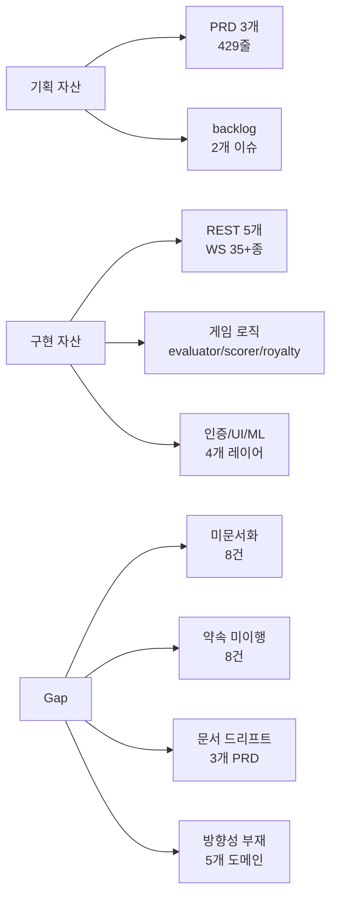
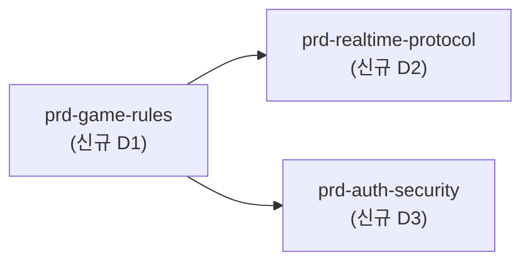
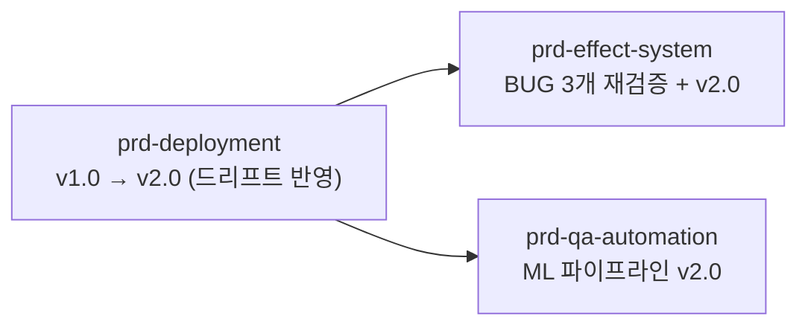
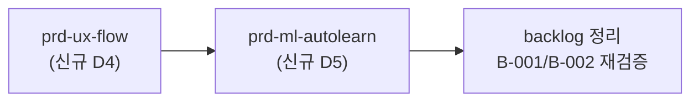

# 기획 문서 보강 전략

**작성일**: 2026-04-17
**작성 동기**: 외부망 배포(`feat/app-deployment`) 단계 진입 + `/check --all` 보안 감사 중 발견된 **"PRD에 없는 핵심 기능"** 대량 확인 → 기획-구현 Gap이 제품의 유지관리 리스크로 전환
**범위**: `docs/00-prd/` 3개 PRD + `docs/backlog.md` vs 현 구현(lib/ + server/)

---

## 1. 핵심 진단 (Executive Summary)



**한 줄 진단**: 제품의 **50% 이상이 기획 문서 커버리지 밖**에서 구현·운영되고 있음. 특히 **게임 규칙 자체에 대한 PRD가 없음**.

**핵심 리스크**:
1. **도메인 지식 휘발**: OFC Pineapple 규칙(FL 진입/유지, Foul 판정, 4P+ Play/Fold)이 코드 주석·커밋 메시지에만 존재 → 신규 참여자 온보딩 불가
2. **보안/인증 스펙 부재**: Google/Kakao/Guest OAuth + JWT 발급/검증/만료 규정이 PRD 없음 → 이번 `/check`의 CRITICAL 2건(비밀번호 게이트 누락, JWT fallback)이 검증 절차 없이 묻힐 뻔
3. **프로토콜 미공식화**: WS 메시지 35+종의 계약(payload 스키마, 에러 코드, 순서)이 문서화되지 않음 → 클라이언트-서버 동기화 문제 발생 시 불변식 기준이 없음
4. **문서 신뢰도 하락**: 기존 3개 PRD 모두 Changelog가 구현을 따라가지 못함 → "PRD를 봐도 실제 상태를 모른다"는 악순환

---

## 2. 4계층 Gap 매트릭스

### A. 미문서화 (Undocumented) — 구현됨, PRD 없음

| # | 기능 영역 | 근거 파일/커밋 | 심각도 |
|---|----------|---------------|:------:|
| A1 | **OFC 게임 코어 규칙** — Top 3장 Quads 불가, 5~6인 Play/Fold 강제, FL 진입/유지 조건 | `evaluator.js:176-210`, `royalty.js:108-129`, `room.js:392` | 🔴 |
| A2 | **인증 시스템** — Google/Kakao/Guest OAuth + JWT 7d | `auth/auth-router.js`, `auth/jwt.js`, `21cb0fd` | 🔴 |
| A3 | **WS 프로토콜 계약** — 35+ 메시지 타입, payload 스키마 | `index.js:351-428`, `room.js` broadcast 전반 | 🔴 |
| A4 | **멀티플레이어 세션 모델** — reconnect(10초), sessionToken, turnTimerGeneration | `room.js:48`, `index.js:488` | 🟠 |
| A5 | **UI 화면 흐름/상태** — login → home → room → game → settings | `lib/ui/screens/*.dart` | 🟠 |
| A6 | **ML 자동 학습 루프** — Detect→Fix→Learn, registry.json, PyTorch/ONNX | `7ce3fd4`, `0ebba78`, `data/models/` | 🟠 |
| A7 | **배포 아키텍처 실제** — docker-compose 2 서비스, nginx 리버스 프록시, SQLite 볼륨 | `docker-compose.yml`, `nginx.conf` | 🟡 |
| A8 | **QA 리포트 파일명 규칙** — `qa-report-{날짜}-{HHMM}.md` | `641f4c2`, CLAUDE.md | 🟡 |

### B. 약속 미이행 (Promised, Not Delivered)

| # | PRD 항목 | 원천 PRD | 상태 |
|---|----------|---------|:----:|
| B1 | Cloudflare Tunnel 배포 스크립트(`deploy-tunnel.sh`) | `prd-deployment` | 미구현 |
| B2 | `docker-compose.prod.yml`, SSL nginx 설정 | `prd-deployment` | 미구현 |
| B3 | Oracle Cloud 상시 운영 | `prd-deployment` | 미구현 |
| B4 | CI/CD GitHub Actions 파이프라인 | `prd-qa-automation` | 미구현 |
| B5 | `npm qa`/`npm qa:soak` scripts | `prd-qa-automation` | 미구현 |
| B6 | Dart `smart_ai.dart` (클라이언트 사이드 AI) | `prd-qa-automation` | 미구현 |
| B7 | EFX-4 Excited 이펙트(`findExcitingCards()`) | `prd-effect-system` | 미구현 |
| B8 | EFX-5 Foul 연출(scatter + shake 조합) | `prd-effect-system` | 미구현 (판정만 존재) |

### C. 문서-구현 Drift (PRD는 있으나 실체와 다름)

| # | PRD | 현실과의 괴리 |
|---|-----|---------------|
| C1 | `prd-deployment` | Cloudflare 중심 설계이나 실제 배포는 `cloudflared quick tunnel`(임시)로만 검증. Oracle/Let's Encrypt는 구현 제로. Changelog v1.0 이후 정지 |
| C2 | `prd-effect-system` | BUG A/B/C 3개 "미해결" 표기 유지 (실제 커밋 흐름상 부분 해결 가능성). W1~W4 사운드 "없음"이 의도인지 미확정. Excited/Foul 연출 실체 없음 |
| C3 | `prd-qa-automation` | L4/L5/L7 커버리지 목표 미달 기록 유지. v1.3 이후 ML 파이프라인(7ce3fd4, 0ebba78) 반영 안 됨. Changelog 4개월 공백 |

### D. 방향성 부재 (Missing North Star)

| # | 도메인 | 왜 PRD가 필요한가 |
|---|--------|-------------------|
| D1 | **OFC 게임 규칙 PRD** (신규) | 게임의 존재 이유. Top=3장, Pineapple draw 3 keep 2, Fantasyland 조건, Foul 판정, Royalty 표가 단일 문서에 정리되지 않음 |
| D2 | **실시간 프로토콜 PRD** (신규) | 35+ WS 메시지의 순서·payload·에러 코드 계약 — 없으면 클라 재작성 시 regression 불가피 |
| D3 | **인증/세션/보안 PRD** (신규) | 이번 감사에서 드러난 CRITICAL 2건은 PRD 부재의 직접 결과. OAuth → JWT → sessionToken → reconnect 전체 흐름 문서화 필요 |
| D4 | **UX/화면 흐름 PRD** (신규) | 화면 전이, 에러 처리, 공백 상태, 이모트/사운드 설정 등 UX 계약 없음 |
| D5 | **ML/자동 학습 PRD** (신규) | QA PRD 범위를 넘어선 독립 시스템. 학습 데이터 스키마, 모델 버전 관리, 평가 기준 필요 |

---

## 3. 보강 우선순위 (Stage별 빌드업)

### Stage 1: 핵심 부재 메우기 (1주 내)



**근거**: A1/A2/A3 + D1/D2/D3 — 제품의 핵심 계약. 이 3건이 없으면 `/check`·`/debug`·신규 참여자 온보딩이 비용 폭발.

### Stage 2: 기존 PRD 복구 (1~2주)



**근거**: C1/C2/C3 + B1~B8 — 기존 약속의 실현 상태를 현실과 일치시킴. Changelog 업데이트 누락 해소.

### Stage 3: 부가 문서 정비 (2주 후)



**근거**: A5/A6/D4/D5 — 코어가 잡힌 후 UX·ML·백로그 정돈.

---

## 4. Stage 1 상세 — 신규 PRD 3종

### 4.1 `prd-game-rules.prd.md` (신규)

**목적**: OFC Pineapple Poker 모든 규칙·공식의 단일 원천(Single Source of Truth)

**최소 구조**:
```
## Overview
## 카드 딜링 규칙
  - 2~4인: R1=5장 / R2~R5=3장 draw 2 keep
  - 5~6인: Play/Fold 단계 + 딜링 배분
  - FL 플레이어: R1에 14장 일괄
## 라인 배치 규칙
  - Top(3장) · Middle(5장) · Bottom(5장)
  - Top Quads 불가 (evaluator.js:210 근거)
  - 강도 순서: Bottom ≥ Middle ≥ Top
## Foul 판정
  - 강도 역전 시 전 라인 0점 + Royalty 무효화 + -6점 (현행 로직 확인 필요)
## Royalty 표 (Top/Middle/Bottom 각각)
## Fantasyland
  - 진입 조건: Top QQ+ (royalty.js:108)
  - 유지 조건: Top Trips / Middle Quads+ / Bottom Straight Flush+ (royalty.js:129)
  - "FL Stay Mid FH" 예외 규칙 명시 (060a77d 커밋)
## 점수 계산
  - 1:1 라인별 비교
  - Scoop 보너스
  - Royalty 합산
## 5~6인 Play/Fold
  - 강제 4명 플레이 조건
  - 기권 규칙
## 특이 케이스
  - discardPile 재활용 (INV4 라운드별 고유성 근거)
  - FL 플레이어 단독 플레이 처리
```

**작성 비용**: 중(~250줄). 기존 `evaluator.js`, `royalty.js`, `scorer.js`, `room.js` 교차 검증 필요.

### 4.2 `prd-realtime-protocol.prd.md` (신규)

**목적**: 클라이언트-서버 WebSocket/REST 계약의 단일 정의

**최소 구조**:
```
## REST API
  - GET /api/rooms — 요청/응답 스키마
  - POST /api/rooms — body/response + 에러 케이스
  - POST /api/quickmatch — password === '' 필터 근거
  - DELETE /api/rooms/:id
  - POST /auth/verify — provider별 스키마
## WebSocket 연결
  - URL 패턴: wss://host/ws/game/{roomId}
  - URL 토큰 deprecated(로그 노출) → 메시지 auth 권장
  - Heartbeat 주기(25s) + missedPong 3회 → 재접속
## C→S 메시지 (14종)
  - 각각 payload 스키마, 전제 조건, 에러 응답
## S→C 메시지 (20+종)
  - 각각 payload 스키마, 브로드캐스트 범위(방/로비/개인)
## 에러 코드 목록
  - INVALID_PASSWORD (신규, 이번 감사에서 추가)
  - rejoinRequired, 세션 만료 등
## 불변식
  - turnTimerGeneration 무효화 규칙
  - reconnect 10초 유예
  - INV1~INV12 (prd-qa-automation에서 이전)
```

**작성 비용**: 대(~400줄). index.js + room.js + online_client.dart 대조 필요.

### 4.3 `prd-auth-security.prd.md` (신규)

**목적**: 인증/권한/세션 전체 흐름 공식화

**최소 구조**:
```
## OAuth 제공자
  - Google (google-auth-library)
  - Kakao (kapi.kakao.com/v2/user/me)
  - Guest (임시 guest_* ID)
## JWT
  - 서명 알고리즘 / 만료 7d / payload 구조
  - JWT_SECRET 필수 (fallback 금지) — 2026-04-17 감사 결과 반영
## 세션 모델
  - sessionToken (방 참가 후 발급) / 재접속 기본키
## 방 보안
  - hasPassword 방 게이트 (2026-04-17 CRITICAL 수정)
  - quickmatch: 비밀번호 방 제외
## Rate limit
  - /auth: 10 req/min (express-rate-limit)
  - trust proxy 설정 필수
## 로깅 규칙
  - 토큰 8자 prefix 규칙
  - URL 토큰 금지(deprecated)
## 위협 모델
  - JWT algorithm none 방어
  - 브루트포스 방어
  - CSRF / CORS 구성
```

**작성 비용**: 중(~200줄). 이번 `/check` 결과가 근거 자료로 바로 활용 가능.

---

## 5. 프로세스 보강 (문서 품질 규칙)

**문제**: 단발 보강은 시간이 지나면 다시 드리프트. 프로세스 변경이 필요.

| 규칙 | 현재 | 개선안 |
|------|------|--------|
| **PRD 범위 제한** | 커밋 메시지가 PRD보다 상세 | feat/fix 커밋은 관련 PRD 섹션 번호 인용 (예: `feat: FL Stay 규칙 개선 (prd-game-rules#Fantasyland)`) |
| **Changelog 갱신** | 수개월 공백 | PR merge hook으로 Changelog 블록 수정 없으면 blocker |
| **범위 외 구현** | 발견 즉시 PRD 신규 없이 반영 | "신규 도메인"(인증/ML 등) 구현 시작 전 stub PRD 작성 강제 |
| **DoD 명시** | 3개 PRD 모두 DoD 없음 | 모든 신규 PRD는 §DoD 필수 |
| **실측 값 반영** | 성능 목표가 추상 (L4 60%→70%) | 최근 QA 리포트 파일명(`docs/04-report/qa-report-*`)을 Changelog에서 링크 |
| **범위 외 명시** | 3개 PRD 모두 범위 외 없음 | 모든 신규 PRD는 §범위 외 필수 (교차 책임 충돌 방지) |

---

## 6. 실행 체크리스트

### 즉시 (이번 주)
- [ ] `docs/01-plan/prd-reinforcement-strategy.md` 리뷰 → 사용자 승인
- [ ] `prd-game-rules.prd.md` Stage 1 skeleton 작성 (§1~§5 placeholder)
- [ ] `prd-auth-security.prd.md` 2026-04-17 감사 결과를 v1.0 초안으로 작성 (근거 자료 확보 완료)

### 1주 내
- [ ] `prd-game-rules.prd.md` 전체 채우기 + evaluator.js/royalty.js 교차 검증 기록
- [ ] `prd-realtime-protocol.prd.md` C→S/S→C 메시지 스키마 전수 추출
- [ ] 기존 PRD 3종 Changelog v2.0 업데이트 (드리프트 반영)

### 2주 내
- [ ] `prd-ux-flow.prd.md` + `prd-ml-autolearn.prd.md` skeleton
- [ ] 프로세스 규칙을 `C:\claude\game_kfc_pro\CLAUDE.md`에 추가

---

## 7. 성공 기준

- **커버리지**: 제품 주요 도메인 7개(게임/프로토콜/인증/배포/이펙트/QA/ML) 각각 PRD 1개 이상 존재
- **신선도**: 모든 PRD Changelog의 최신 항목이 최근 30일 내
- **검증 가능성**: `/check --all` 감사 결과가 PRD 섹션으로 역추적 가능
- **온보딩**: 신규 참여자가 PRD만 읽고 게임 규칙과 시스템 아키텍처를 이해 가능

---

## Changelog

| 날짜 | 버전 | 변경 내용 | 변경 유형 | 결정 근거 |
|------|------|-----------|-----------|-----------|
| 2026-04-17 | v1.0 | 최초 작성 — 기획 문서 ↔ 구현 Gap 매트릭스 + Stage 1~3 보강 전략 | - | `/check --all` 감사 + 3-agent 병렬 인벤토리 |
